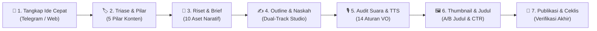

<div align="center">

# 🎬 Zeinity Creator Assistant

**Studio Produksi Konten & Naskah Spoken-First Berbasis AI untuk Kreator YouTube**

[](https://github.com/zenqyverse/zeinity-creator-assistants)
[](https://react.dev/)
[](https://www.typescriptlang.org/)
[](https://vitejs.dev/)
[](https://tailwindcss.com/)
[](https://supabase.com/)

[**English**](README.md) &bull; [**Bahasa Indonesia**](README.id.md)

</div>

---

> [!WARNING]
> ### ⚠️ Status Proyek: Masih Dalam Tahap Pengembangan Aktif
> **Aplikasi web Zeinity Creator Assistant saat ini masih berada dalam tahap pengembangan aktif (*Alpha / Work in Progress*).**
> Cetak biru arsitektur, skema basis data, dan jalur *prompting* AI masih terus disempurnakan. Sejumlah fitur, integrasi *multi-agent*, dan *Edge Functions* dapat mengalami perubahan berkala sebelum mencapai rilis stabil versi 1.0.

---

## 📖 Gambaran Umum & Filosofi

**Zeinity Creator Assistant** adalah studio rekayasa konten khusus yang dirancang untuk kreator YouTube dengan standar narasi tinggi. Aplikasi ini menjembatani kesenjangan antara penangkapan ide mentah, perumusan struktur narasi yang kokoh, hingga penulisan naskah utuh siap rekam menggunakan prinsip **Zeinity Spoken-First Narrative System**.

### Mengapa Bukan Sekadar "Prompt Generator" Biasa?
Mayoritas alat bantu AI hanya berfungsi sebagai generator teks biasa yang menghasilkan gaya tulisan kaku, repetitif, dan penuh klise robotik khas AI ("mari selami", "sebagai kesimpulan", "seiring berjalannya waktu"). Zeinity Creator Assistant dibangun di atas filosofi **Human-in-the-Loop (HITL)** yang tegas:
1. **Batasan Narasi Terstruktur**: AI bekerja di dalam batas aturan yang ketat (5 Babak Eskalasi, Dekonstruksi Jawaban Klise, 10 Aset Naratif).
2. **Aturan Audio & Voiceover (Spoken-First)**: Penulisan naskah menerapkan 14 aturan spoken-first—melarang penggunaan tanda pisah panjang em dash (`—`), titik dua (`:`), serta tanda kurung bertingkat yang merusak intonasi suara manusia maupun kealamian TTS (*Text-to-Speech*).
3. **Alur Kerja Dual-Track**: Kreator dapat menulis langsung di dalam In-App Studio aplikasi atau mengekspor prompt handoff instan (0-token) untuk model eksternal seperti Claude 3.5 Sonnet, ChatGPT, maupun DeepSeek.
4. **Riwayat Snapshot & Versi Draf**: Setiap iterasi revisi AI memiliki isolasi riwayat, sehingga kreator dapat mengembalikan draf sebelumnya dalam satu klik tanpa risiko kehilangan progres tulisan.

---

## ⚡ Fitur Utama

- **🚀 Dual-Track Scriptwriter Studio**:
  - *Jalur A (In-App AI Studio)*: Konfigurasi target jumlah kata (preset 8–12 menit, ~1.300–1.950 kata atau kustom), hasilkan outline narasi bertingkat, lakukan persetujuan (*Human Approval Gate*), lalu tulis naskah babak demi babak langsung di aplikasi.
  - *Jalur B (External Handoff)*: Generator *prompt* 0-token 1-klik yang siap disalin ke model LLM eksternal tercanggih.
- **🧠 6 Mesin Prompt & Scripting Terpadu**:
  1. *Research Brief Prompt*: Mengekstrak 10 Aset Naratif, klaim utama, dan batasan verifikasi dari dokumen sumber yang diunggah.
  2. *Script Outline Prompt*: Merumuskan 5 babak narasi dengan eskalasi konflik yang jelas.
  3. *Scriptwriter Brief Prompt*: Memasukkan persona pembicara dan 14 aturan audio voiceover (*spoken-first*).
  4. *Spoken & TTS Audio Audit*: Menganalisis naskah pada 4 dimensi penting dengan format laporan terstruktur (`BAGIAN ASLI -> MASALAH -> REVISI -> ALASAN`).
  5. *Visual Cue Annotator*: Memberikan anotasi visual fungsional (`[BUKTI]`, `[JELASKAN]`, `[KONTEKS]`, `[TEKANKAN]`, `[RITME]`).
  6. *Thumbnail & Hook Copy Engine*: Menghasilkan 3 konsep thumbnail ber-CTR tinggi, pembanding sudut pandang (taruhan vs pertanyaan), serta teks kontras 2–4 kata.
- **🔄 Multi-AI Provider Gateway**:
  - **Google Gemini**: Integrasi API bawaan (`gemini-1.5-flash`, `gemini-1.5-pro`).
  - **OpenRouter**: Akses ke Claude 3.5 Sonnet, DeepSeek V3/R1, Llama 3, dan lainnya.
  - **Ollama Lokal**: Inferensi AI 100% luring, gratis, dan privat di komputer sendiri (`http://localhost:11434`) dengan penyesuaian otomatis batas konteks.
- **🛡️ Arsitektur Hibrida Offline/Cloud**:
  - *Safe Offline Mode*: Beroperasi tanpa konfigurasi rumit menggunakan `localStorage` peramban dan cache memori. Berjalan lancar tanpa akun cloud.
  - *Supabase Cloud Sync*: Opsi sinkronisasi basis data PostgreSQL dengan langganan data *real-time* untuk kolaborasi tim.
- **📱 Tangkap Ide Cepat via Bot Telegram**:
  - Catat ide konten secara kilat di ponsel melalui bot Telegram menggunakan perintah praktis (`/start`, `/help`, `/pillars`, `/pipeline`, `/latest`).
  - Webhook memicu notifikasi desktop dan pembaruan tabel seketika.
- **📂 Dropzone Berkas & Ekstraksi Dokumen**:
  - Parsing dokumen langsung di peramban untuk berkas `.docx` (via Mammoth), `.md`, `.txt`, dan `.csv`.
  - Manajemen berkas permanen di *FileManager* untuk lampiran riset.
- **🎨 Antarmuka Estetis Glassmorphism**:
  - Nuansa warna gradasi biru indigo dan deep space, efek blur transparan, tabel responsif, serta laci terminal melayang untuk memantau log proses AI secara *real-time*.

---

## 📋 Panduan SOP Harian (Standard Operating Procedure)

Alur kerja harian ini dirancang sistematis dari ide mentah hingga video selesai diproduksi:



### Fase 1: Tangkap Ide Cepat (Mobile / Desktop)
- **Melalui Ponsel**: Kirimkan transkrip rekaman suara atau catatan ide kilat ke **Bot Telegram** resmi Anda. Bot akan otomatis merespons dan mencatatnya ke dalam tahap `Idea`.
- **Melalui Desktop**: Buka aplikasi web, klik tombol `+ Tambah Ide`, tuliskan judul atau topik pembuka, dan pilih label sumber (`Web` atau `Telegram`).

### Fase 2: Triase & Klasifikasi Pilar
- Pada tampilan **Pipeline Naskah**, temukan ide yang baru dicatat dan tentukan salah satu dari 5 Pilar Konten Zeinity:
  1. *AI Automation* (Otomasi alur kerja, Agen AI, Sistem otonom)
  2. *Future Tech* (Paradigma komputasi baru, Robotika, Teknologi masa depan)
  3. *System Thinking* (Model mental, Optimasi sistem, Feedback loops)
  4. *Digital Leverage* (Media, Kode, Distribusi berskala besar)
  5. *Deep Work* (Fokus tingkat tinggi, Produktivitas kognitif, *Craftsmanship*)
- Klik tombol **Buka Studio** pada baris konten.

### Fase 3: Pemasukan Riset & Ekstraksi Brief Naratif
- Seret berkas materi referensi (`.docx`, `.md`, `.txt`, atau `.csv`) ke dalam area **Dropzone Riset**, atau tempel teks riset manual.
- Klik **Ekstrak & Analisis Riset**. Mesin AI akan memproses naskah sumber dan merumuskan **Research Brief** yang memuat:
  - 10 Aset Naratif (premis inti, kontraintuitif, bukti data, taruhan/konsekuensi).
  - Batasan verifikasi fakta agar tidak terjadi halusinasi AI.

### Fase 4: Penyusunan Outline & Penulisan Naskah (Dual-Track)
1. Pada tab **Scripting**, tentukan target durasi video (contoh: preset `8-12 Menit (~1.300 - 1.950 kata)`).
2. Klik **Generate Outline** untuk menghasilkan 5 babak narasi bereskalasi:
   - *Hook & Dekonstruksi Premis*
   - *Asumsi Umum yang Keliru (The Wrong Assumption)*
   - *Mekanisme Kunci / Pengungkapan Inti*
   - *Penerapan Taktis & Nuansa Praktis*
   - *Konklusi Filosofis & Ajakan Bertindak*
3. Tinjau dan perbaiki outline langsung di editor. Bila sudah mantap, klik **Setujui Outline (Approve Gate)**.
4. Pilih jalur penulisan naskah:
   - **Jalur In-App**: Klik **Tulis Naskah via AI** untuk memproses draf babak demi babak dilengkapi penghitung kata *real-time* dan fitur *auto-save*.
   - **Jalur External Handoff**: Klik **Salin Prompt Scriptwriter** untuk menyalin paket prompt berstandar ke Claude 3.5 Sonnet atau ChatGPT.

### Fase 5: Audit Kualitas Suara & Aturan Voiceover (Spoken-First)
- Klik tombol **Audit Naskah (Spoken & TTS)**.
- Sistem akan memindai draf naskah terhadap 14 aturan audio percakapan:
  - Menghapus tanda pisah em dash (`—`) dan titik dua (`:`) yang mengganggu ritme pembacaan narator atau mesin TTS.
  - Memangkas klise AI generik ("Mari selami lebih dalam...", "Di era yang serba cepat ini...").
  - Memecah kalimat majemuk yang terlalu panjang menjadi kalimat lisan yang mengalir natural.
- Klik terapkan revisi atau bandingkan draf melalui tampilan komparasi naskah.

### Fase 6: Konsep Thumbnail & Judul Mode A/B
- Lanjutkan ke area kerja **Thumbnailing**.
- Klik tombol **Generate Konsep Thumbnail & Judul**.
- Evaluasi hasil kreasi:
  - **Judul Mode A (Curiosity & Taruhan Tinggi)** vs **Judul Mode B (Manfaat Langsung & Transformasi)** sesuai panduan komunitas YouTube.
  - 3 Konsep visual thumbnail dengan kontras warna subjek dan teks pancingan 2–4 kata.
  - Anotasi visual fungsional (`[BUKTI]`, `[JELASKAN]`, `[KONTEKS]`, `[TEKANKAN]`, `[RITME]`) untuk memudahkan proses penyuntingan video di Premiere Pro / DaVinci Resolve.

### Fase 7: Ceklis Produksi Akhir & Publikasi
- Tinjau **Ceklis Produksi Cerdas** (Pengecekan intonasi naskah, kesiapan rekaman audio, perakitan aset b-roll).
- Klik tombol **Tandai Selesai (Publish)** untuk memindahkan konten ke **Arsip Produksi** dan memperbarui statistik durasi serta produktivitas di halaman Analytics.

---

## 🛠️ Tumpukan Teknologi

| Komponen | Pilihan Teknologi |
|---|---|
| **Frontend Utama** | React 18.3, TypeScript 5.5, Vite 5.4 |
| **Gaya & Desain** | Tailwind CSS 3.4, Vanilla CSS Custom Variables, Desain Glassmorphism |
| **Ikon & Antarmuka** | Lucide React, Indikator animasi SVG |
| **Pemroses Dokumen** | Mammoth.js (pembaca `.docx`), FileReader Web API |
| **Penyimpanan Lokal** | Browser LocalStorage, State reaktif in-memory |
| **Basis Data Cloud** | Supabase (PostgreSQL 15, Keamanan RLS, Edge Functions) |
| **Gateway Inferensi AI** | Google Generative AI SDK, OpenRouter API, Ollama Lokal |
| **Kerangka Pengujian** | Penguji bawaan Node.js (`node:test`, `node:assert/strict`) |

---

## 🚀 Panduan Instalasi & Setup Lokal

### 1. Prasyarat Sistem
Pastikan perangkat Anda telah terpasang:
- **Node.js**: Versi 18.0.0 ke atas ([Unduh Node.js](https://nodejs.org/))
- **npm** (otomatis ada bersama Node) atau **pnpm** / **yarn**
- **Git** ([Unduh Git](https://git-scm.com/))
- *(Opsional)* **Ollama** ([Unduh Ollama](https://ollama.com/)) bila ingin menjalankan AI lokal.

### 2. Kloning Repositori
```bash
git clone https://github.com/zenqyverse/zeinity-creator-assistants.git
cd zeinity-creator-assistants
```

### 3. Pasang Dependensi
```bash
npm install
```

### 4. Konfigurasi Variabel Lingkungan (.env)
Salin berkas template `.env.example` menjadi `.env`:
```bash
cp .env.example .env
```

Buka file `.env` menggunakan teks editor Anda (semua variabel bersifat opsional; aplikasi akan otomatis berjalan di Safe Offline Mode jika dikosongkan):
```env
# Konfigurasi Supabase (Opsional - kosongkan bila ingin mode luring penuh)
VITE_SUPABASE_URL=https://proyek-anda.supabase.co
VITE_SUPABASE_ANON_KEY=anon-public-key-anda

# Kunci API Google Gemini (Opsional - dapat juga diisi langsung via menu Settings)
VITE_GEMINI_API_KEY=kunci_api_gemini_anda
```

> [!TIP]
> **Keamanan Kunci API**: Anda tidak diwajibkan menuliskan API key ke dalam file `.env`. Kunci API Google Gemini, OpenRouter, atau endpoint Ollama dapat dimasukkan langsung melalui menu **Settings** di aplikasi. Kunci yang dimasukkan via Settings diisolasi aman di penyimpanan lokal peramban Anda (*localStorage*) dan tidak pernah dikirim ke peladen publik.

### 5. Jalankan Server Pengembangan
```bash
npm run dev
```
Buka peramban favorit Anda dan akses alamat `http://localhost:5173`.

### 6. Menjalankan Pengujian Otomatis
Pastikan seluruh 141+ pengujian fitur berjalan sukses:
```bash
npm test
```

### 7. Membangun Proyek untuk Produksi
```bash
npm run build
npm run preview
```

---

## 🤖 Menjalankan AI Lokal (Ollama)

Untuk produksi naskah yang 100% gratis, aman, dan tanpa koneksi internet:
1. Pasang Ollama dari [ollama.com](https://ollama.com/).
2. Unduh model rekomendasi:
   ```bash
   ollama run llama3:8b
   # atau
   ollama run qwen2.5:7b
   ```
3. Di dalam web app Zeinity Creator Assistant, masuk ke menu **Settings** (`/settings`), pilih AI Provider **Ollama (Lokal)**, dan pastikan alamat URL mengarah ke `http://localhost:11434`.

---

## 📁 Struktur Direktori Repositori

```
zeinity-creator-assistants/
├── docs/                               # Dokumentasi sistem, PRD & laporan eksekutif
│   ├── architecture/                   # Spesifikasi arsitektur & integrasi Telegram
│   ├── blueprints/                     # Cetak biru multi-AI & rencana output prompt
│   ├── reports/                        # Laporan audit frontend & diagnosis teknis
│   └── strategy/                       # Strategi channel YouTube & aturan spoken-first
├── public/                             # Aset statis peramban
├── scripts/                            # Skrip pemeliharaan & audit kode
├── src/                                # Kode sumber aplikasi React
│   ├── components/                     # Komponen UI (Sidebar, Topbar, Modal Dialog)
│   ├── hooks/                          # Custom hooks (useContent, useSettings, useFiles)
│   ├── lib/                            # Mesin AI (gemini.ts), Supabase client, parser
│   ├── views/                          # Halaman utama (Overview, ContentTable, ScriptDetail, dll.)
│   ├── App.tsx                         # Entri utama aplikasi & perutean navigasi
│   ├── index.css                       # Gaya CSS glassmorphism & animasi
│   ├── main.tsx                        # Titik pasang DOM
│   └── types.ts                        # Definisi tipe & interface TypeScript
├── supabase/                           # Berkas konfigurasi Supabase
│   ├── functions/                      # Deno Edge Functions (telegram-webhook)
│   └── migrations/                     # Skrip migrasi SQL & kebijakan RLS
├── test/                               # Berkas pengujian otomatis (141+ pengujian)
├── .env.example                        # Contoh berkas konfigurasi variabel lingkungan
├── .gitignore                          # Berkas & direktori yang diabaikan Git
├── package.json                        # Metadata proyek & skrip npm
├── tsconfig.json                       # Konfigurasi kompilator TypeScript
└── vite.config.ts                      # Konfigurasi bundler Vite
```

---

## 🗺️ Peta Pengembangan (Roadmap)

- [x] Alur Lengkap 5 Tahap Konten Human-in-the-Loop
- [x] Dual-Track In-App AI Scriptwriter & External Handoff
- [x] Penegakan 14 Aturan Voiceover & Spoken-First TTS
- [x] Integrasi Tangkap Ide Telegram Bot & Webhook
- [x] Gateway Multi-Provider AI (Gemini, OpenRouter, Ollama)
- [x] Safe Offline Mode (Penyimpanan Lokal Mandiri)
- [ ] Integrasi langsung YouTube Data API untuk unggah metadata otomatis
- [ ] Sintesis pratinjau audio naskah langsung di studio via ElevenLabs / Edge-TTS
- [ ] Ekspor naskah ke format Teleprompter / Final Draft `.fdx`

---

## 📄 Lisensi & Hak Cipta

Proyek ini dilisensikan di bawah lisensi [MIT License](LICENSE).

Dibuat dengan dedikasi untuk **Ekosistem Kreator Zeinity**.
