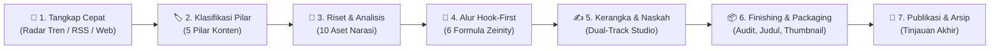

<div align="center">


# 🎬 Zeinity Creator Assistant

**Studio Produksi Konten & Naskah Spoken-First Berbasis AI untuk Kreator YouTube**

[](https://github.com/zenqyverse/zeinity-creator-assistants)
[](test/)
[](https://react.dev/)
[](https://www.typescriptlang.org/)
[](https://vitejs.dev/)
[](https://tailwindcss.com/)
[](https://supabase.com/)

[**English**](README.md) &bull; [**Bahasa Indonesia**](README.id.md)

</div>

---

> [!WARNING]
> ### ⚠️ Status Proyek: Masih Dalam Tahap Pengembangan Aktif
> **Aplikasi web Zeinity Creator Assistant saat ini masih berada dalam tahap pengembangan aktif (*Alpha / Work in Progress*).**
> Cetak biru arsitektur, skema basis data, dan alur *prompting* AI terus disempurnakan. Sejumlah fitur, integrasi *multi-agent*, dan *Edge Functions* dapat mengalami perubahan berkala sebelum mencapai rilis stabil versi 1.0.

---

## 📖 Gambaran Umum & Filosofi

**Zeinity Creator Assistant** adalah studio rekayasa konten khusus yang dirancang untuk kreator YouTube dengan standar narasi tinggi. Aplikasi ini menjembatani kesenjangan antara penangkapan ide mentah, intelijen tren, perumusan struktur narasi yang kokoh, hingga penulisan naskah utuh siap rekam menggunakan prinsip **Zeinity Spoken-First Narrative System**.

---

## 🔄 Evolusi Besar: Dari "Prompt Generator" Menjadi "AI Content Studio"

Pada awal pengembangan, hasil evaluasi sistem mendiagnosis bahwa aplikasi ini bekerja seolah-olah sekadar *middleman* atau pabrik instruksi prompt statis:
```
Kreator ➔ Aplikasi ➔ (Salin Prompt) ➔ LLM Eksternal ➔ (Tempel Hasil) ➔ Aplikasi ➔ (Salin Prompt Lagi)...
```
Alur tersebut membebani kreator dengan kerja manual bolak-balik yang melelahkan. Berdasarkan diagnosis tersebut, sistem dirombak secara menyeluruh melalui **transformasi arsitektur besar** untuk mengubah identitas aplikasi dari generator instruksi menjadi **Studio Orkestrasi & Rekan Kreatif AI (Human-in-the-Loop)**:

| Aspek | Kondisi Lama (Prompt Generator) | Kondisi Sekarang (Zeinity Studio Orchestrator) |
|---|---|---|
| **Identitas Inti** | Pabrik pembuat instruksi prompt | Studio produksi video & intelijen tren *end-to-end* |
| **Beban Pengguna** | Kerja keras salin-tempel manual | Aksi AI langsung 1-klik, pengguna fokus kurasi, gerbang persetujuan & arahan kreatif |
| **Bentuk Output** | String teks prompt mentah | Draf naskah hidup, diff audit terstruktur, mockup vektor interaktif, revisi instan |
| **Penulisan Naskah** | Di notepad atau Google Docs luar | Dual-Track Studio dengan alur Hook-First, penghitung kata & *auto-save* |
| **Alur Finishing** | Pop-up terfragmentasi & checklist terpisah | Studio Finishing & Packaging 2-Panel Master-Detail terpadu |
| **Kualitas Audio** | Bahasa tulisan kaku penuh klise AI | Penegakan ketat 14 aturan *spoken-first* + sub-sesi poles *Kasual Friendly* |
| **Integritas Draf** | Menimpa teks berisiko hilangnya draf | Riwayat snapshot draf dengan *Undo Revisi AI* 1-klik & *caching offline* |
| **Istilah Antarmuka** | "Prompts", "Generator", "Output" | **"Pipeline Naskah"** & **"Draft Studio"** |
| **Kendali Model** | Dropdown API statis | **Switcher Interaktif di Topbar & Auto-Fallback 4 Lapis** |

---

## 🏗️ Fase Rekayasa & Transformasi Besar

### Fase 1: Stabilitas Integritas Data & Pencegahan Kehilangan Data
- **Isolasi State Komponen**: Enkapsulasi penuh state di `ScriptDetail.tsx` untuk mencegah kebocoran data antar-konten saat kreator berpindah ide.
- **Konfirmasi Aksi Destruktif**: Seluruh tombol penghapusan (penghapusan ide di `ContentTable`, berkas di `FileManager`, maupun token API di `Settings`) wajib melewati dialog konfirmasi `AlertModal`.
- **Ketahanan Filter Dinamis**: Menghilangkan *bug* tabrakan filter pada `ContentTable.tsx` yang sebelumnya memicu fenomena data *blackout*.
- **Ketahanan Offline**: Penambahan *fallback cache* pada `useFiles.ts` dan penanganan unggah berkas yang andal.

### Fase 2: Kontinuitas Naskah, Mesin AI & Studio In-App
- **Kontinuitas Naskah Antar-Tahapan**: Naskah yang sedang disusun mengalir tanpa putus dari tahap Scripting, Finishing & Packaging, hingga Published Detail tanpa risiko terhapus.
- **Sistem Riwayat Snapshot Draf**: Dilengkapi modal riwayat snapshot yang memungkinkan kreator meninjau iterasi draf sebelumnya dan melakukan *Undo Revisi AI* seketika.
- **Generator Judul Alternatif (Mode A & B)**: Merumuskan dua sudut pandang judul yang mematuhi standar komunitas YouTube (Mode A: Rasa Ingin Tahu & Taruhan Tinggi vs Mode B: Manfaat Langsung).
- **Mesin Impor Massal (Bulk Ingest)**: Mendukung impor puluhan ide sekaligus dari berkas CSV, Markdown, dan teks polos dengan deteksi pemisah otomatis.
- **Penerusan Konteks Penuh**: Catatan ide awal pengguna (`research_text`) otomatis diteruskan ke seluruh konteks prompt AI di tahapan berikutnya.
- **Dukungan Dokumen Word Asli**: Penguraian berkas `.docx` langsung di browser menggunakan Mammoth.js di samping berkas `.md`, `.txt`, dan `.csv`.
- **Optimasi AI Lokal Ollama**: Manajemen batas konteks (*context window chunking*) dinamis untuk mencegah memori habis (*out of memory*) pada model komputer lokal.

### Fase 3: Ergonomi, Metrik Produksi & Pembaruan UI
- **Pembaruan Bingkai Istilah UI**: Menghapus seluruh sebutan usang "Prompt Generator". Mengganti kolom antarmuka menjadi **"Pipeline Naskah"** dan **"Draft Studio"**.
- **Navigasi Revert Tersinkronisasi**: Memperbaiki router navigasi dan riwayat URL agar tindakan *revert* status memperbarui UI dan basis data secara bersamaan.
- **Judul Interaktif & Textarea Ergonomis**: Pengubahan judul langsung dengan klik ganda (*inline rename*) dan textarea yang membesar otomatis tanpa memotong teks.
- **Metrik Analisis Produksi Riil**: Rekalkulasi metrik durasi produksi di halaman Analytics untuk mengukur kecepatan siklus ide hingga publikasi secara akurat.

### Fase 4: Blueprint Webhook Bot Telegram *(Edge Function — Perlu Di-deploy Manual)*
- **Webhook Deno Tanpa Server (Blueprint Siap Pakai)**: Supabase Edge Function (`telegram-webhook`) dengan validasi tajuk rahasia (`X-Telegram-Bot-Api-Secret-Token`). Kode fungsi sudah lengkap di `supabase/functions/telegram-webhook/` namun memerlukan deployment manual via `supabase functions deploy telegram-webhook`.
- **Penyaringan Akses Whitelist**: Keamanan berbasis daftar ID obrolan terverifikasi (`telegram_allowed_chat_ids`).
- **Pencatatan Ide Seketika**: Setelah di-deploy, langganan Supabase Realtime langsung memunculkan notifikasi *toast* dan menyisipkan baris ide baru tanpa *reload* halaman. Listener Realtime di frontend sudah aktif di `useContent.ts`.
- **Perintah Slash Lengkap**: Mendukung interaksi bot via `/start`, `/help`, `/pillars`, `/id`, `/pipeline`, dan `/latest`.

### Fase 5: Pipeline Naskah Hook-First & Human Gatekeeper
- **Arsitektur Hook-First**: Merestrukturisasi alur kerangka penulisan naskah di mana hook pembuka video (0–30 detik) dirumuskan dan dikunci *sebelum* menyusun kerangka 5 babak naskah.
- **6 Formula Hook Resmi Zeinity**:
  1. *The Provocative Question* (Pertanyaan Provokatif & Menggugat)
  2. *The Counter-Intuitive Claim* (Klaim Kontra-Intuitif / Melawan Arus)
  3. *The Hard Truth / Negative Warning* (Kebenaran Pahit & Peringatan Keras)
  4. *The Secret / Hidden Mechanism* (Membongkar Mekanisme Rahasia)
  5. *The Story / High-Stakes Narrative* (Kisah Dramatis & Taruhan Tinggi)
  6. *The Paradigm Shift* (Pergeseran Paradigma Radikal)
- **Mesin Rekomendasi AI**: Menghasilkan 3 variasi hook terkurasi dengan label formula, lencana rekomendasi AI (`Rekomendasi AI ✨`), analisis alasan kecocokan, dan skor keyakinan (*confidence score*).
- **Human Gatekeeper Guard**: Tombol aksi *Generate Outline 5 Tahap* di-disable secara ketat hingga kreator secara sadar memilih atau menyusun hook pembuka, menjamin arah narasi yang terarah.
- **Ruang Kerja Hook Collapsible**: Akordion lipat di `OutlineWorkspace.tsx` memungkinkan kreator melipat kartu hook setelah selesai agar dapat fokus 100% pada penulisan outline.
- **Pre-Flight Bar Ringkas (+200px Ruang Kerja Bebas)**: Menyederhanakan bilah konfigurasi pre-flight yang sebelumnya memakan ruang vertikal 200px+ menjadi baris pill status kompak dengan modal interaktif `⚙ Setelan`.

### Fase 6: Konsolidasi Studio Finishing & Packaging & Poles Kasual Narasi
- **Penyederhanaan Tab Kerja Menjadi 2 Workspace Utama**:
  1. `✍️ 1. Studio Naskah` (Fokus penuh pada alur Hook-First, penyusunan kerangka, dan penulisan naskah utuh).
  2. `📦 2. Finishing & Packaging` (Penyatuan terpadu Spoken Audit, 5 Formula Judul, dan Studio Thumbnail).
- **Tata Letak Master-Detail 2-Panel**:
  - **Panel Kiri (Stepper & Progres Packaging)**:
    - Indikator progres visual: *"Progres Packaging: X dari 3 Selesai (Y%)"*.
    - 3 Kartu Stepper Vertikal menggantikan checklist statis lama di bawah halaman:
      - *Kartu 1: Audit Spoken & TTS* (Status SELESAI / PERLU AUDIT, counter temuan).
      - *Kartu 2: 5 Formula Judul* (Status JUDUL TERPILIH / 5 VARIAN SIAP, preview judul aktif, status ramah layar HP).
      - *Kartu 3: Studio Thumbnail* (Status SEDANG AKTIF / SIAP, rasio 16:9, preview hook teks kapital).
    - Tombol cepat: *"Kembali ke Studio Naskah"*.
  - **Panel Kanan (Kanvas Sub-Studio Aktif)**:
    - **Sub-Studio 1 (Audit Spoken & TTS)**:
      - Kartu Diff Interaktif: `BAGIAN ASLI` vs `REVISI SPOKEN / TTS` disertai diagnosis kendala dan alasan perbaikan VO.
      - 1-Klik *"Terapkan Revisi ke Draf Naskah"*.
      - **Sub-Sesi Poles Kasual Friendly**: Sub-tahap khusus (`runCasualAudit`) yang mentransformasi diksi kaku/akademis/ensiklopedia menjadi bahasa tutur kasual yang akrab, santai, dan mengalir seperti teman sebaya tanpa bahasa alay dan tanpa melanggar prosodi TTS (bebas em dash `—` dan titik dua `:`).
      - Navigasi sekuensial: *"Lanjut ke 5 Formula Judul ➔"*.
    - **Sub-Studio 2 (5 Formula Judul Zeinity)**:
      - 5 varian formula hook (*Curiosity & High Stakes*, *Direct Transformation*, *Contrarian Belief*, *Numerical Proof*, *The Big Question*).
      - Indikator judul aktif (`Judul Utama Aktif ✓`) dan 1-klik *"Gunakan sbg Judul"*.
      - Navigasi sekuensial: *"Lanjut ke Studio Thumbnail ➔"*.
    - **Sub-Studio 3 (Inline Studio Thumbnail & SVG Canvas)**:
      - Tampilan inline 2 kolom langsung di kanvas utama (tanpa pop-up modal terpisah).
      - Kiri: Input teks hook huruf kapital dengan penghitung karakter & 4 preset instan (*ILUSI DIBONGKAR*, *FAKTA TERSEMBUNYI*, *JEBAKAN SISTEM*, *AKHIRNYA TERUNGKAP*), pemilih rasio aspek (`16:9`, `1:1`, `9:16`), dropdown provider AI gambar, dan textarea prompt Midjourney dengan tombol salin/regenerate.
      - Kanan: Pratinjau kanvas mockup SVG vektor real-time di sisi klien (0 token, 0 biaya API), batas panduan *Safe Zone 80%*, checklist Standar Mutu Bab 13, dan tombol *"Unduh Mockup SVG (Vektor HD)"*.
      - Hero Footer Bar: Tombol *"Tandai Siap Publikasi / Publish ➔"* untuk transisi langsung ke status Published.

### Fase 7: Intelijen Konten (Radar Tren & RSS Reader Studio)
- **🔥 Radar Tren & Sinyal Konten**:
  - Pemantauan tren YouTube Most Popular via YouTube Data API v3 dan Google Daily Search Trends via umpan RSS XML secara langsung.
  - Penyaringan regional (Indonesia `ID` & Global `US`) dan filter kategori YouTube.
  - Logika penyegaran data independen per sub-tab yang terverifikasi.
  - Tangkap ide 1-klik **⚡ Tambah ke Ide** dengan deteksi duplikasi judul dan umpan balik *toast*.
  - Widget ringkas di Overview Dashboard: **Radar Sinyal Terhangat** menampilkan 3 topik teratas.
- **📰 RSS Reader Studio & Agregator Kurasi**:
  - Agregator kurasi berita lintas 4 tab kategori (*Media & Berita*, *Blog Teknologi & AI*, *Forum & Komunitas*, *Koleksi Saya*) yang dipetakan ke 5 Pilar Konten Zeinity.
  - Pemuatan bertahap (*Muat Lebih Banyak* +10 item) dan *lazy fetching* untuk efisiensi beban browser.
  - Manajemen Sumber Feed Lengkap (CRUD): Tambah, edit inline (✏️), hapus permanen (🗑️), dan toggle status aktif/nonaktif dengan migrasi Supabase `20261001150000_create_rss_sources_table.sql`.
  - Penguraian XML tangguh: pembukaan bungkus CDATA, penguraian entitas HTML/numerik, fallback scraper gambar OpenGraph, dan pengecualian tracking pixel 1x1.
  - Tombol pengalih status baca (*Mark as Read / Unread*) ringkas dan ramah mobile.
  - Panduan lengkap tersedia di: [📡 Panduan Mencari & Menggunakan Link RSS Feed](docs/PANDUAN_MENCARI_RSS.md).
- **Reposisi Navigasi**:
  - Tab menu "Radar Tren" dan "RSS Reader" diposisikan di Sidebar tepat di bawah tab "Published".

### 🛡️ Ketahanan Mesin AI Router & Integrasi 100% 9Router Gateway
- **Integrasi 9Router Gateway**: Dukungan penuh gerbang lokal berbasis OpenAI-compatible endpoint (`http://localhost:20128/v1`).
- **Dukungan 9Remote & Deployment Cloud**: Dukungan penuh untuk web app yang di-deploy ke cloud (Vercel, Netlify, Cloudflare Pages) agar dapat tersambung ke 9Router lokal melalui tunnel publik aman CORS (`abc-tunnel.us` atau Cloudflare tunnel). Memiliki deteksi otomatis remote origin (`window.location.hostname !== 'localhost'`) yang secara cerdas beralih dari URL localhost ke endpoint tunnel publik dari environment variables.
- **Pilihan Combo Presets vs Model Spesifik**: Beralih bebas antara racikan multi-model terkurasi (`Creator-Combo`, `Jarvis_Creator`) atau model individual langsung (Groq Llama 3.3 70B, Google Gemini 2.0 Flash, DeepSeek, dsb).
- **Rantai Auto-Fallback Multi-Provider (4 Lapis)**: Mekanisme failover dinamis (`9Router Gateway` ➔ `Google Gemini` ➔ `OpenRouter` ➔ `Ollama Lokal`). Bila suatu provider terkena limit kuota atau gagal terhubung, studio otomatis mengalihkan tugas ke provider berikutnya dengan log transparan di laci Terminal.
- **Topbar 1-Click AI Switcher**: Widget interaktif pada bilah atas untuk mengganti model instan, memantau latensi koneksi, dan membuka jalan pintas ke Settings tanpa mengganggu alur kerja.

### Fase 8: Audit UI/UX Menyeluruh & Remediasi Desain Sistem
- **Integritas Data & Pencegah Kehilangan Draf (P0)**: Penjaga perubahan belum tersimpan (*dirty-state guard*) pada klik backdrop modal dan tombol Escape (`AddIdeaModal`, `BulkImportModal`), mencegah hilangnya ide secara tak sengaja. Persistensi dinamis `active_provider` pada Settings.
- **Aksesibilitas & Manajemen Fokus Keyboard (P1)**: Hook universal `useFocusTrap` pada seluruh modal, rasio kontras warna WCAG AA (`--muted: #9eb3cf`, 6.84:1), penskalaan tipografi mikro ke `>= 12px` (`0.75rem`), tautan pintas aksesibilitas `Lewati ke Konten Utama` (*Skip link*), dan pembersihan tombol semu.
- **Ergonomi Navigasi Desktop (P1)**: Tata letak sidebar persisten pada layar desktop (`>= 1024px`) dengan semantik `aria-current="page"`. Sub-tab toggle responsif studio naskah pada tablet (`<= 960px`) dan target sentuh mobile minimal 44px.
- **Standardisasi Skala Z-Index & Arsitektur Modal (P1/P2)**: Skala tokenized (`--z-header: 30`, `--z-sidebar: 30`, `--z-dropdown: 70`, `--z-terminal: 80`, `--z-modal: 1000`, `--z-zen: 1050`, `--z-alert: 2000`).
- **Pembersihan Pipeline & Polishing Studio**: Pemisahan bersih tab Sumber Konten dan filter Status Pipeline, eliminasi sniffing string URL, perampingan panel AI Gateway di Sidebar khusus untuk 9Router, dan eliminasi kebocoran label wireframe teknis.

---

## ⚡ Fitur Utama

- **🚀 Dual-Track Scriptwriter Studio**:
  - *Track A (In-App AI Studio)*: Konfigurasi target jumlah kata (preset 8–12 menit, ~1.300–1.950 kata atau kustom), buat kerangka narasi babak demi babak, validasi melalui gerbang persetujuan (*Human Gatekeeper*), dan susun draf naskah langsung di aplikasi.
  - *Track B (External Handoff)*: Generator prompt instan 0-token yang siap disalin ke model eksternal unggulan (Claude 3.5 Sonnet, ChatGPT, DeepSeek).
- **🎯 Mesin Narasi Hook-First**:
  - 6 Formula Hook Zeinity dengan rekomendasi AI otomatis, skor keyakinan, dan perlindungan *Human Gatekeeper*.
- **📦 Studio Finishing & Packaging Terpadu**:
  - Ruang kerja 2-Panel Master-Detail yang menggabungkan Audit Spoken & Kasual, 5 Formula Judul, dan Studio Pembuatan Thumbnail inline.
- **🎙️ Poles Audio & Voiceover Dua Tahap**:
  - Tahap 1: Penegakan 14 aturan *Spoken-First* & audit prosodi TTS dengan kartu *diff* interaktif.
  - Tahap 2: Sub-sesi transformasi gaya bahasa ke tutur kasual akrab (*Casual-Friendly*).
- **🖼️ Studio Thumbnail Inline & Kanvas Vektor SVG**:
  - Pratinjau langsung mockup SVG vektor di sisi klien, panduan *Safe Zone 80%*, checklist Standar Mutu Bab 13, unduh mockup SVG HD, dan tombol publikasi langsung.
- **🔥 Radar Tren & Sinyal Konten**:
  - Pemantauan tren YouTube Data API v3 & Google Search Trends harian dengan aksi tangkap ide 1-klik.
- **📰 RSS Reader Studio & Agregator Kurasi**:
  - Agregator kurasi berita 4 kategori yang dipetakan ke pilar Zeinity dengan CRUD feed lengkap dan gambar OpenGraph otomatis.
- **🔄 Multi-AI Provider Gateway & Fallback**:
  - 9Router Gateway (`custom`), Google Gemini SDK, OpenRouter REST API, Local Ollama API dengan failover otomatis 4 tingkat.
- **🛡️ Arsitektur Hibrida Offline/Cloud**:
  - Operasional lokal tanpa konfigurasi menggunakan `localStorage` dengan opsi sinkronisasi cloud Supabase PostgreSQL.
- **📱 Penangkapan Cepat Bot Telegram** *(Memerlukan Deployment Edge Function)*:
  - Rekam ide dari ponsel melalui bot Telegram dengan sinkronisasi langsung ke dasbor web.

---

## 📋 SOP Harian Kreator (Standard Operating Procedure)

Alur kerja standar yang memandu kreator dari sekadar percikan ide hingga video siap publikasi:



### Tahap 1: Tangkap Ide Cepat (Radar Tren, RSS, atau Telegram)
- **Dari Tren & RSS**: Telusuri **Radar Tren** atau **RSS Reader Studio**, tekan tombol **⚡ Tambah ke Ide** untuk memasukkan topik ke pipeline produksi seketika.
- **Di Ponsel**: Kirim pesan suara atau catatan teks langsung ke bot Telegram tertaut.
- **Di Komputer**: Buka aplikasi web, tekan `+ Tambah Ide`, isi judul ide, dan pilih sumber ide.

### Tahap 2: Triase & Klasifikasi Pilar Konten
- Di tampilan **Pipeline Naskah**, kelompokkan ide ke salah satu dari 5 Pilar Konten Zeinity:
  1. *AI Automation* (Alur kerja, Agentic AI, Sistem otonom)
  2. *Future Tech* (Paradigma baru, Komputasi masa depan, Robotika)
  3. *System Thinking* (Model mental, Optimasi sistem, Feedback loops)
  4. *Digital Leverage* (Media, Kode, Distribusi berskala luas)
  5. *Deep Work* (Fokus mendalam, Karya intelektual bernilai tinggi)
- Klik **Buka Studio** untuk masuk ke ruang produksi naskah.

### Tahap 3: Unggah Riset & Ekstraksi Brief
- Letakkan berkas acuan (`.docx`, `.pdf`, `.md`, atau `.txt`) ke dalam **Dropzone Riset**.
- Klik **Ekstrak & Analisis Riset** untuk menghasilkan 10 Aset Narasi dan batasan verifikasi data.

### Tahap 4: Penentuan Hook Pembuka (Hook-First)
- Di **Studio Naskah**, pelajari 6 Formula Hook Zeinity.
- Klik **Generate Rekomendasi Hook** untuk meninjau opsi hook terbaik dari AI beserta skor keyakinan dan alasannya.
- Pilih atau susun hook pembuka (durasi 0–30 detik) untuk membuka akses ke tahap perumusan outline.

### Tahap 5: Pembuatan Outline & Penulisan Naskah
1. Tentukan target durasi atau jumlah kata di bilah pre-flight ringkas.
2. Klik **Generate Outline 5 Tahap** untuk membedah 5 babak narasi yang memuncak secara dramatis.
3. Tinjau dan kunci persetujuan naskah melalui gerbang **Setujui Outline**.
4. Tulis naskah:
   - **In-App Studio**: Tulis babak demi babak (*per-beat*) dengan penghitung kata langsung dan penyimpanan otomatis.
   - **External Handoff**: Salin prompt 0-token terstruktur untuk digunakan di Claude 3.5 Sonnet atau ChatGPT.

### Tahap 6: Studio Finishing & Packaging (Tab 2)
1. Buka tab **Finishing & Packaging**:
2. **Sub-Studio 1 (Audit Spoken & TTS)**:
   - Jalankan audit untuk meninjau kartu perbandingan interaktif (`BAGIAN ASLI` vs `REVISI SPOKEN / TTS`).
   - Lanjutkan ke **Sub-Sesi Poles Kasual Friendly** untuk mencairkan bahasa kaku menjadi percakapan hangat.
   - Klik **Terapkan Revisi ke Draf Naskah**.
3. **Sub-Studio 2 (5 Formula Judul)**:
   - Generate 5 varian judul hook Zeinity.
   - Klik **Gunakan sbg Judul** untuk memilih judul ramah layar ponsel.
4. **Sub-Studio 3 (Studio Thumbnail)**:
   - Ketik 2–4 kata hook kapital atau pilih preset (*ILUSI DIBONGKAR*, *FAKTA TERSEMBUNYI*, dsb).
   - Tinjau kanvas mockup SVG vektor interaktif dengan panduan *Safe Zone 80%*.
   - Unduh berkas mockup SVG HD untuk referensi tim desain grafis.
   - Klik tombol utama **Tandai Siap Publikasi / Publish ➔**.

### Tahap 7: Publikasi & Arsip
- Konten berpindah ke **Arsip Produksi** dan memperbarui metrik analitik durasi produksi.

---

## 🛠️ Rincian Teknologi (Tech Stack)

| Lapisan | Teknologi |
|---|---|
| **Inti Frontend** | React 18.3, TypeScript 5.5, Vite 5.4 |
| **Tata Gaya Visual** | Tailwind CSS 3.4, Variabel CSS Murni, Desain Glassmorphism |
| **Ikon & Indikator** | Lucide React, Indikator berpendar SVG kustom |
| **Pengolahan Berkas** | Mammoth.js (pengurai `.docx`), FileReader API browser |
| **Manajemen State & Offline** | Browser LocalStorage, Reactive In-memory Cache |
| **Backend & Realtime** | Supabase (PostgreSQL 15, Row Level Security, Edge Functions) |
| **Inference AI & Gateway** | 9Router Gateway (`http://localhost:20128/v1`), Google Gemini SDK, OpenRouter REST API, Local Ollama API |
| **Pengujian Otomatis** | Penguji bawaan Node.js (`node:test`, `node:assert/strict`) — **238 Tes Lulus / 36 Suites** |

---

## 🚀 Panduan Memulai & Instalasi

### 1. Kebutuhan Sistem
Pastikan perangkat Anda telah terpasang:
- **Node.js**: versi 18.0.0 atau lebih tinggi ([Unduh Node.js](https://nodejs.org/))
- **npm** (bawaan Node) atau **pnpm** / **yarn**
- **Git** ([Unduh Git](https://git-scm.com/))
- *(Opsional)* **9Router** atau **Ollama** ([Unduh Ollama](https://ollama.com/)) untuk inferensi AI lokal/remote.

### 2. Kloning Repositori
```bash
git clone https://github.com/zenqyverse/zeinity-creator-assistants.git
cd zeinity-creator-assistants
```

### 3. Instalasi Dependensi
```bash
npm install
```

### 4. Konfigurasi Kunci Akses (Environment Variables)
Salin berkas acuan `.env.example`:
```bash
cp .env.example .env
```

Buka `.env` dan masukkan kunci Anda (semua kunci bersifat opsional; aplikasi otomatis berjalan dalam mode *Safe Offline Mode* jika dibiarkan kosong):
```env
# Konfigurasi Supabase (Opsional - kosongkan untuk mode lokal tanpa internet)
VITE_SUPABASE_URL=https://your-project-id.supabase.co
VITE_SUPABASE_ANON_KEY=your-anon-public-key

# Kunci API Google Gemini (Opsional - dapat juga diatur lewat halaman Pengaturan di aplikasi)
VITE_GEMINI_API_KEY=kunci_api_gemini_anda_di_sini

# 9Router AI Gateway - Deployment Jarak Jauh (Opsional - untuk hosting Vercel/Netlify)
VITE_CUSTOM_GATEWAY_ENDPOINT=https://rje2m9z.abc-tunnel.us/v1
VITE_CUSTOM_GATEWAY_API_KEY=sk-kunci-api-9router-anda
```

### 5. Menjalankan Server Pengembangan
```bash
npm run dev
```
Buka browser dan kunjungi `http://localhost:5173`.

### 6. Menjalankan Pengujian Otomatis
Jalankan 238 pengujian otomatis di 36 rangkaian suite:
```bash
npm test
```

### 7. Membangun untuk Produksi
```bash
npm run build
npm run preview
```

---

## 🤖 Konfigurasi AI Lokal & Remote (9Router & Ollama)

### A. 9Router Gateway & 9Remote
1. **Mode Lokal**: Jalankan server 9Router lokal di port `20128`:
   ```bash
   # Endpoint standar: http://localhost:20128/v1
   ```
2. **Mode Remote (9Remote / Cloudflare Tunnel)**:
   - Saat dideploy ke cloud (Vercel / Netlify / Cloudflare Pages), gunakan endpoint tunnel publik aman CORS (misal: `https://rje2m9z.abc-tunnel.us/v1`).
   - Aplikasi otomatis mengenali origin non-localhost dan memprioritaskan endpoint tunnel publik.
   - Tombol preset cepat untuk **Default Lokal**, **9Router Remote**, dan **Cloudflare Direct Tunnel** tersedia di menu **Settings** (`/settings`).
3. Aplikasi otomatis menetapkan **`custom` (9Router Gateway)** sebagai provider aktif bawaan dengan model `Creator-Combo`.

### B. Ollama (100% Bebas Kuota & Tanpa Internet)
1. Unduh dan instal Ollama dari [ollama.com](https://ollama.com/).
2. Unduh model rekomendasi:
   ```bash
   ollama run llama3:8b
   # atau
   ollama run qwen2.5:7b
   ```
3. Di Zeinity Creator Assistant, masuk ke menu **Settings** (`/settings`), ubah Provider ke **Ollama (Lokal)**, dan pastikan endpoint mengarah ke `http://localhost:11434`.

---

## 📁 Struktur Direktori Repositori

```
zeinity-creator-assistants/
├── docs/                               # Dokumentasi sistem & PRD
│   ├── architecture/                   # Spesifikasi arsitektur & Telegram
│   ├── blueprints/                     # Cetak biru prompt & multi-AI
│   ├── reports/                        # Laporan audit eksekutif & diagnosis
│   └── strategy/                       # Strategi channel YouTube & aturan spoken-first
├── public/                             # Aset statis resmi (logo, banner, favicon)
├── scripts/                            # Skrip audit & pemeliharaan kode
├── src/                                # Kode sumber aplikasi React
│   ├── assets/                         # Aset visual aplikasi
│   ├── components/                     # Komponen UI (Sidebar, Topbar, Modals, Script studio)
│   ├── hooks/                          # Kumpulan hook (useContent, useSettings, useFiles)
│   ├── lib/                            # Mesin AI (gemini.ts), klien Supabase, parser, RSS
│   ├── views/                          # Tampilan utama (Overview, ContentTable, ScriptDetail, TrendRadar, RSSReader, Settings)
│   ├── App.tsx                         # Router utama aplikasi
│   ├── index.css                       # Desain glassmorphism & animasi
│   ├── main.tsx                        # Pemasangan DOM
│   └── types.ts                        # Definisi tipe data TypeScript
├── supabase/                           # Berkas konfigurasi Supabase
│   ├── functions/                      # Deno Edge Functions (telegram-webhook)
│   └── migrations/                     # Skrip migrasi SQL & kebijakan RLS
├── test/                               # Berkas pengujian otomatis (238 tes di 36 suites)
├── vercel.json                         # Konfigurasi rewrite SPA Vercel
├── .env.example                        # Template berkas environment
├── .gitignore                          # Berkas yang diabaikan Git
├── package.json                        # Metadata paket & skrip Node.js
├── tsconfig.json                       # Konfigurasi kompilator TypeScript
└── vite.config.ts                      # Konfigurasi build bundler Vite
```

---

## 🗺️ Peta Pengembangan (Roadmap)

- [x] Pipeline Konten 5 Tahap Lengkap Berbasis Manusia (*Human-in-the-Loop*)
- [x] Pipeline Naskah Hook-First dengan 6 Formula Zeinity & *Human Gatekeeper*
- [x] Studio Naskah AI In-App Dual-Track & Serah Terima Prompt Eksternal
- [x] Penegakan 14 Aturan *Spoken-First Voiceover* & Prosodi TTS
- [x] Sub-Sesi Poles Suara Kasual Friendly (`runCasualAudit`)
- [x] Konsolidasi Studio Finishing & Packaging 2-Panel Master-Detail
- [x] Kanvas Pratinjau Mockup Thumbnail Vektor SVG Inline & Panduan *Safe Zone 80%*
- [x] Radar Tren (YouTube Data API v3 & Google Search Trends RSS XML)
- [x] RSS Reader Studio dengan CRUD Sumber Feed, Fallback OpenGraph & Toggle Dibaca/Belum
- [x] Gateway Multi-Model 9Router & Rantai Failover Otomatis dengan Dukungan Cloud 9Remote
- [x] Switcher Model AI Interaktif 1-Klik di Topbar
- [x] Mode Aman Offline (LocalStorage) & Riwayat Snapshot Draf
- [x] Impor Masal Ide Konten (CSV, Markdown, Teks Polos)
- [x] Resolusi Audit 128 Tombol UI & Konfigurasi SPA Vercel
- [~] Tangkap Ide Cepat via Bot Telegram *(Fungsi Edge Function siap — perlu deployment manual; listener Realtime di frontend aktif)*
- [ ] Integrasi YouTube Data API langsung untuk publikasi otomatis metadata
- [ ] Sintesis pratinjau audio ElevenLabs / Edge-TTS langsung di dalam studio
- [ ] Ekspor naskah ke format Teleprompter / Final Draft `.fdx`

---

## 📄 Lisensi & Hak Cipta

Proyek ini dilisensikan di bawah [MIT License](LICENSE).

Dibuat dengan ❤️ untuk **Ekosistem Kreator Zeinity**.
