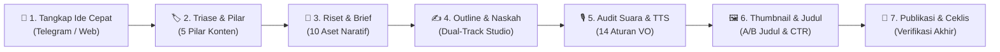

<div align="center">


# 🎬 Zeinity Creator Assistant

**Studio Produksi Konten & Naskah Spoken-First Berbasis AI untuk Kreator YouTube**

[](https://github.com/zenqyverse/zeinity-creator-assistants)
[](test/)
[](https://react.dev/)
[](https://www.typescriptlang.org/)
[](https://vitejs.dev/)
[](https://tailwindcss.com/)
[](https://supabase.com/)

[**English**](README.md) &bull; [**Bahasa Indonesia**](README.id.md)

</div>

---

> [!WARNING]
> ### ⚠️ Status Proyek: Masih Dalam Tahap Pengembangan Aktif
> **Aplikasi web Zeinity Creator Assistant saat ini masih berada dalam tahap pengembangan aktif (*Alpha / Work in Progress*).**
> Cetak biru arsitektur, skema basis data, dan jalur *prompting* AI masih terus disempurnakan. Sejumlah fitur, integrasi *multi-agent*, dan *Edge Functions* dapat mengalami perubahan berkala sebelum mencapai rilis stabil versi 1.0.

---

## 📖 Gambaran Umum & Filosofi

**Zeinity Creator Assistant** adalah studio rekayasa konten khusus yang dirancang untuk kreator YouTube dengan standar narasi tinggi. Aplikasi ini menjembatani kesenjangan antara penangkapan ide mentah, perumusan struktur narasi yang kokoh, hingga penulisan naskah utuh siap rekam menggunakan prinsip **Zeinity Spoken-First Narrative System**.

---

## 🔄 Evolusi Besar: Dari "Prompt Generator" Menjadi "AI Content Studio"

Pada awal pengembangan, hasil evaluasi sistem mendiagnosis bahwa aplikasi ini bekerja seolah-olah sekadar *middleman* atau pabrik instruksi prompt statis:
```
Kreator ➔ Aplikasi ➔ (Salin Prompt) ➔ LLM Eksternal ➔ (Tempel Hasil) ➔ Aplikasi ➔ (Salin Prompt Lagi)...
```
Alur tersebut membebani kreator dengan kerja manual bolak-balik yang melelahkan. Berdasarkan diagnosis tersebut, sistem dirombak secara menyeluruh melalui **4 fase transformasi arsitektur besar** untuk mengubah identitas aplikasi dari generator instruksi menjadi **Studio Orkestrasi & Rekan Kreatif AI (Human-in-the-Loop)**:

| Aspek | Kondisi Lama (Prompt Generator) | Kondisi Sekarang (Zeinity Studio Orchestrator) |
|---|---|---|
| **Identitas Inti** | Pabrik pembuat instruksi prompt | Studio produksi video ujung-ke-ujung (*end-to-end*) |
| **Beban Pengguna** | Kerja keras salin-tempel manual | Aksi AI langsung 1-klik, pengguna fokus kurasi & *approval* |
| **Bentuk Output** | String teks prompt mentah | Draf naskah hidup, laporan audit terstruktur, revisi instan |
| **Penulisan Naskah** | Di notepad atau Google Docs luar | Dual-Track Studio dengan penghitung kata & *auto-save* |
| **Kualitas Audio** | Bahasa tulisan kaku penuh klise AI | Penegakan ketat 14 aturan *spoken-first* & audit audio TTS |
| **Integritas Draf** | Menimpa teks berisiko hilangnya draf | Riwayat snapshot draf dengan fitur *Undo Revisi AI* 1-klik |
| **Istilah Antarmuka** | "Prompts", "Generator", "Output" | **"Pipeline Naskah"** & **"Draft Studio"** |
| **Kendali Model** | Dropdown API statis | **Switcher Interaktif di Topbar & Auto-Fallback 4 Lapis** |

---

## 🏗️ 4 Fase Rekayasa & Transformasi Besar

### Fase 1: Stabilitas Integritas Data & Pencegahan Kehilangan Data
- **Isolasi State Komponen**: Enkapsulasi penuh state di `ScriptDetail.tsx` untuk mencegah kebocoran data antar-konten saat kreator berpindah ide.
- **Konfirmasi Aksi Destruktif**: Seluruh tombol penghapusan (penghapusan ide di `ContentTable`, berkas di `FileManager`, maupun token API di `Settings`) wajib melewati dialog konfirmasi `AlertModal`.
- **Ketahanan Filter Dinamis**: Menghilangkan *bug* tabrakan filter pada `ContentTable.tsx` yang sebelumnya memicu fenomena data *blackout*.
- **Ketahanan Offline**: Penambahan *fallback cache* pada `useFiles.ts` dan penanganan unggah berkas yang andal.

### Fase 2: Kontinuitas Naskah, Mesin AI & Studio In-App
- **Kontinuitas Naskah Antar-Tahapan**: Naskah yang sedang disusun mengalir tanpa putus dari tahap Scripting, Thumbnailing, hingga Published Detail tanpa risiko terhapus.
- **Sistem Riwayat Snapshot Draf**: Dilengkapi modal riwayat snapshot yang memungkinkan kreator meninjau iterasi draf sebelumnya dan melakukan *Undo Revisi AI* seketika.
- **Generator Judul Alternatif (Mode A & B)**: Merumuskan dua sudut pandang judul yang mematuhi standar komunitas YouTube (Mode A: Rasa Ingin Tahu & Taruhan Tinggi vs Mode B: Manfaat Langsung).
- **Mesin Impor Massal (Bulk Ingest)**: Mendukung impor puluhan ide sekaligus dari berkas CSV, Markdown, dan teks polos dengan deteksi pemisah otomatis.
- **Penerusan Konteks Penuh**: Catatan ide awal pengguna (`research_text`) otomatis diteruskan ke seluruh konteks prompt AI di tahapan berikutnya.
- **Dukungan Dokumen Word Asli**: Penguraian berkas `.docx` langsung di browser menggunakan Mammoth.js di samping berkas `.md`, `.txt`, dan `.csv`.
- **Optimasi AI Lokal Ollama**: Manajemen batas konteks (*context window chunking*) dinamis untuk mencegah memori habis (*out of memory*) pada model komputer lokal.

### Fase 3: Ergonomi, Metrik Produksi & Pembaruan UI
- **Pembaruan Bingkai Istilah UI**: Menghapus seluruh sebutan usang "Prompt Generator". Mengganti kolom antarmuka menjadi **"Pipeline Naskah"** dan **"Draft Studio"**.
- **Navigasi Revert Tersinkronisasi**: Memperbaiki router navigasi dan riwayat URL agar tindakan *revert* status memperbarui UI dan basis data secara bersamaan.
- **Judul Interaktif & Textarea Ergonomis**: Pengubahan judul langsung dengan klik ganda (*inline rename*) dan textarea yang membesar otomatis tanpa memotong teks.
- **Metrik Analisis Produksi Riil**: Rekalkulasi metrik durasi produksi di halaman Analytics untuk mengukur kecepatan siklus ide hingga publikasi secara akurat.

### Fase 4: Blueprint Webhook Bot Telegram *(Edge Function — Perlu Di-deploy Manual)*
- **Webhook Deno Tanpa Server (Blueprint Siap Pakai)**: Supabase Edge Function (`telegram-webhook`) dengan validasi tajuk rahasia (`X-Telegram-Bot-Api-Secret-Token`). Kode fungsi sudah lengkap di `supabase/functions/telegram-webhook/` namun memerlukan deployment manual via `supabase functions deploy telegram-webhook`.
- **Penyaringan Akses Whitelist**: Keamanan berbasis daftar ID obrolan terverifikasi (`telegram_allowed_chat_ids`).
- **Pencatatan Ide Seketika**: Setelah di-deploy, langganan Supabase Realtime langsung memunculkan notifikasi *toast* dan menyisipkan baris ide baru tanpa *reload* halaman. Listener Realtime di frontend sudah aktif di `useContent.ts`.
- **Perintah Slash Lengkap**: Mendukung interaksi bot via `/start`, `/help`, `/pillars`, `/id`, `/pipeline`, dan `/latest`.

### 🛡️ Ketahanan Mesin AI Router & Integrasi 100% 9Router Gateway
- **Integrasi 9Router Gateway**: Dukungan penuh gerbang lokal berbasis OpenAI-compatible endpoint (`http://localhost:20128/v1`).
- **Dukungan 9Remote & Deployment Cloud**: Dukungan penuh untuk web app yang di-deploy ke cloud (Vercel, Netlify, Cloudflare Pages) agar dapat tersambung ke 9Router lokal melalui tunnel publik aman CORS (`abc-tunnel.us` atau Cloudflare tunnel). Memiliki deteksi otomatis remote origin (`window.location.hostname !== 'localhost'`) yang secara cerdas beralih dari URL localhost usang ke endpoint tunnel publik dari environment variables.
- **Pilihan Combo Presets vs Model Spesifik**: Beralih bebas antara racikan multi-model terkurasi (seperti `Creator-Combo`, `Jarvis_Creator`) atau model individual langsung (Groq Llama 3.3 70B, Google Gemini 2.0 Flash, DeepSeek, dsb).
- **Rantai Auto-Fallback Multi-Provider (4 Lapis)**: Mekanisme failover dinamis (`9Router Gateway` ➔ `Google Gemini` ➔ `OpenRouter` ➔ `Ollama Lokal`). Bila suatu provider terkena limit kuota atau gagal terhubung, studio otomatis mengalihkan tugas ke provider berikutnya dengan log transparan di laci Terminal.
- **Topbar 1-Click AI Switcher**: Widget interaktif pada bilah atas untuk mengganti model instan, memantau latensi koneksi, dan membuka jalan pintas ke Settings tanpa mengganggu alur menulis.

### 🔍 Resolusi Audit 128 Elemen Tombol Frontend
Melakukan audit menyeluruh terhadap **128 tombol** di seluruh antarmuka web:
- **Nol Zombie UI**: Menghubungkan seluruh tombol *placeholder* statis ke logika aktif atau menyembunyikannya secara bersih.
- **Pencegahan Reload Halaman**: Menetapkan atribut eksplisit `type="button"` pada seluruh tombol untuk mencegah *form submission* liar yang mereset status aplikasi.

---

## ⚡ Fitur Utama

- **🚀 Dual-Track Scriptwriter Studio**:
  - *Jalur A (In-App AI Studio)*: Konfigurasi target jumlah kata (preset 8–12 menit, ~1.300–1.950 kata atau kustom), hasilkan outline narasi bertingkat, lakukan persetujuan (*Human Approval Gate*), lalu tulis naskah babak demi babak langsung di aplikasi.
  - *Jalur B (External Handoff)*: Generator *prompt* 0-token 1-klik yang siap disalin ke model LLM eksternal tercanggih (Claude 3.5 Sonnet, ChatGPT, DeepSeek).
- **🧠 6 Mesin Prompt & Scripting Terpadu**:
  1. *Research Brief Prompt*: Mengekstrak 10 Aset Naratif, klaim utama, dan batasan verifikasi dari dokumen sumber yang diunggah.
  2. *Script Outline Prompt*: Merumuskan 5 babak narasi dengan eskalasi konflik yang jelas.
  3. *Scriptwriter Brief Prompt*: Memasukkan persona pembicara dan 14 aturan audio voiceover (*spoken-first*).
  4. *Spoken & TTS Audio Audit*: Menganalisis naskah pada 4 dimensi penting dengan format laporan terstruktur (`BAGIAN ASLI -> MASALAH -> REVISI -> ALASAN`).
  5. *5-Formula Rekomendasi Judul Hook*: Menghasilkan 5 varian judul berdasarkan formula hook Zeinity dengan aksi salin dan terapkan untuk A/B testing.
  6. *Thumbnail & Hook Copy Engine*: Menghasilkan 3 konsep thumbnail ber-CTR tinggi, pembanding sudut pandang (taruhan vs pertanyaan), serta teks kontras 2–4 kata.
- **🔄 Multi-AI Provider Gateway & Fallback**:
  - **9Router Gateway (`custom`)**: Gerbang AI lokal (`http://localhost:20128/v1`) dengan preset Combo dan model spesifik.
  - **Google Gemini**: Integrasi API bawaan (`gemini-1.5-flash`, `gemini-1.5-pro`).
  - **OpenRouter**: Akses ke Claude 3.5 Sonnet, DeepSeek V3/R1, Llama 3, dan lainnya.
  - **Ollama Lokal**: Inferensi AI 100% luring, gratis, dan privat di komputer sendiri (`http://localhost:11434`) dengan penyesuaian otomatis batas konteks.
- **🛡️ Arsitektur Hibrida Offline/Cloud**:
  - *Safe Offline Mode*: Beroperasi tanpa konfigurasi rumit menggunakan `localStorage` peramban dan cache memori. Berjalan lancar tanpa akun cloud.
  - *Supabase Cloud Sync*: Opsi sinkronisasi basis data PostgreSQL dengan langganan data *real-time* untuk kolaborasi tim.
- **📱 Tangkap Ide Cepat via Bot Telegram** *(Perlu Deployment Edge Function)*:
  - Catat ide konten secara kilat di ponsel melalui bot Telegram menggunakan perintah praktis (`/start`, `/help`, `/pillars`, `/pipeline`, `/latest`).
  - Webhook memicu notifikasi desktop dan pembaruan tabel seketika — setelah Edge Function `telegram-webhook` di-deploy ke Supabase. Lihat `supabase/MIGRATION.md` untuk panduan setup.
- **📂 Dropzone Berkas & Ekstraksi Dokumen**:
  - Parsing dokumen langsung di peramban untuk berkas `.docx` (via Mammoth), `.md`, `.txt`, dan `.csv`.
  - Manajemen berkas permanen di *FileManager* untuk lampiran riset.
- **🔥 Radar Tren & Sinyal Konten (YouTube & Google Trends)**:
  - Pemantauan real-time tren YouTube (*Most Popular*) via YouTube Data API v3 dan Google Daily Search Trends via XML RSS.
  - Filter regional (`ID` Indonesia & `US` Global) serta kategori YouTube.
  - Tangkap ide instan 1-klik **⚡ Tambah ke Ide** langsung ke pipeline konten dengan deteksi duplikasi dan umpan balik toast.
  - Widget dashboard **Radar Sinyal Terhangat** di Overview menampilkan 3 topik terhangat secara ringkas.
- **📰 RSS Reader Studio & Agregator Kurasi**:
  - Agregator berita multi-sumber dalam 4 kategori (*Media & Berita*, *Blog Teknologi & AI*, *Forum & Komunitas*, *Koleksi Saya*) yang terpetakan ke 5 Pilar Konten Zeinity.
  - Pemuatan bertahap (*Muat 10 Artikel Lagi*) dan pemuatan malas (*lazy fetch per kategori*) untuk performa lancar tanpa beban lag.
  - Manajer Sumber Feed Lengkap (CRUD): Tambah, **Edit (✏️)** langsung di baris, **Hapus Permanen (🗑️)**, dan toggle **Aktif/Nonaktif** untuk semua feed.
  - Penanganan CORS multi-lapis: Vite dev-server proxy (`/api/feed-proxy`), Vercel serverless proxy, dan proxy publik cadangan.
  - Panduan lengkap tersedia di [📡 Panduan Praktis: Menemukan & Menggunakan Link RSS Feed](docs/PANDUAN_MENCARI_RSS.md).
- **🎨 Desain Glassmorphism Estetis & Branding Resmi**:
  - Gradasi biru indigo dan deep space, efek blur transparan, tabel responsif, laci terminal melayang untuk log AI *real-time*, serta aset logo dan banner resmi Zeinity.

---

## 📋 Panduan SOP Harian (Standard Operating Procedure)

Alur kerja harian ini dirancang sistematis dari ide mentah hingga video selesai diproduksi:



### Fase 1: Tangkap Ide Cepat (Mobile / Desktop)
- **Melalui Ponsel**: Kirimkan transkrip rekaman suara atau catatan ide kilat ke **Bot Telegram** resmi Anda. Bot akan otomatis merespons dan mencatatnya ke dalam tahap `Idea`.
- **Melalui Desktop**: Buka aplikasi web, klik tombol `+ Tambah Ide`, tuliskan judul atau topik pembuka, dan pilih label sumber (`Web` atau `Telegram`).

### Fase 2: Triase & Klasifikasi Pilar
- Pada tampilan **Pipeline Naskah**, temukan ide yang baru dicatat dan tentukan salah satu dari 5 Pilar Konten Zeinity:
  1. *AI Automation* (Otomasi alur kerja, Agen AI, Sistem otonom)
  2. *Future Tech* (Paradigma komputasi baru, Robotika, Teknologi masa depan)
  3. *System Thinking* (Model mental, Optimasi sistem, Feedback loops)
  4. *Digital Leverage* (Media, Kode, Distribusi berskala besar)
  5. *Deep Work* (Fokus tingkat tinggi, Produktivitas kognitif, *Craftsmanship*)
- Klik tombol **Buka Studio** pada baris konten.

### Fase 3: Pemasukan Riset & Ekstraksi Brief Naratif
- Seret berkas materi referensi (`.docx`, `.md`, `.txt`, atau `.csv`) ke dalam area **Dropzone Riset**, atau tempel teks riset manual.
- Klik **Ekstrak & Analisis Riset**. Mesin AI akan memproses naskah sumber dan merumuskan **Research Brief** yang memuat:
  - 10 Aset Naratif (premis inti, kontraintuitif, bukti data, taruhan/konsekuensi).
  - Batasan verifikasi fakta agar tidak terjadi halusinasi AI.

### Fase 4: Penyusunan Outline & Penulisan Naskah (Dual-Track)
1. Pada tab **Scripting**, tentukan target durasi video (contoh: preset `8-12 Menit (~1.300 - 1.950 kata)`).
2. Pilih model AI aktif langsung dari **Topbar Switcher** (misalnya `Creator-Combo` atau `Google Gemini`).
3. Klik **Generate Outline** untuk menghasilkan 5 babak narasi bereskalasi:
   - *Hook & Dekonstruksi Premis*
   - *Asumsi Umum yang Keliru (The Wrong Assumption)*
   - *Mekanisme Kunci / Pengungkapan Inti*
   - *Penerapan Taktis & Nuansa Praktis*
   - *Konklusi Filosofis & Ajakan Bertindak*
4. Tinjau dan perbaiki outline langsung di editor. Bila sudah mantap, klik **Setujui Outline (Approve Gate)**.
5. Pilih jalur penulisan naskah:
   - **Jalur In-App**: Klik **Tulis Naskah via AI** untuk memproses draf babak demi babak dilengkapi penghitung kata *real-time* dan fitur *auto-save*.
   - **Jalur External Handoff**: Klik **Salin Prompt Scriptwriter** untuk menyalin paket prompt berstandar ke Claude 3.5 Sonnet atau ChatGPT.

### Fase 5: Audit Kualitas Suara & Aturan Voiceover (Spoken-First)
- Klik tombol **Audit Naskah (Spoken & TTS)**.
- Sistem akan memindai draf naskah terhadap 14 aturan audio percakapan:
  - Menghapus tanda pisah em dash (`—`) dan titik dua (`:`) yang mengganggu ritme pembacaan narator atau mesin TTS.
  - Memangkas klise AI generik ("Mari selami lebih dalam...", "Di era yang serba cepat ini...").
  - Memecah kalimat majemuk yang terlalu panjang menjadi kalimat lisan yang mengalir natural.
- Klik terapkan revisi atau bandingkan draf melalui tampilan komparasi naskah.

### Fase 6: Konsep Thumbnail & Judul Mode A/B
- Lanjutkan ke area kerja **Thumbnailing**.
- Klik tombol **Generate Konsep Thumbnail & Judul**.
- Evaluasi hasil kreasi:
  - **Judul Mode A (Curiosity & Taruhan Tinggi)** vs **Judul Mode B (Manfaat Langsung & Transformasi)** sesuai panduan komunitas YouTube.
  - 3 Konsep visual thumbnail dengan kontras warna subjek dan teks pancingan 2–4 kata.
  - Anotasi visual fungsional (`[BUKTI]`, `[JELASKAN]`, `[KONTEKS]`, `[TEKANKAN]`, `[RITME]`) untuk memudahkan proses penyuntingan video di Premiere Pro / DaVinci Resolve.

### Fase 7: Ceklis Produksi Akhir & Publikasi
- Tinjau **Ceklis Produksi Cerdas** (Pengecekan intonasi naskah, kesiapan rekaman audio, perakitan aset b-roll).
- Klik tombol **Tandai Selesai (Publish)** untuk memindahkan konten ke **Arsip Produksi** dan memperbarui statistik durasi serta produktivitas di halaman Analytics.

---

## 🛠️ Tumpukan Teknologi

| Komponen | Pilihan Teknologi |
|---|---|
| **Frontend Utama** | React 18.3, TypeScript 5.5, Vite 5.4 |
| **Gaya & Desain** | Tailwind CSS 3.4, Vanilla CSS Custom Variables, Desain Glassmorphism |
| **Ikon & Antarmuka** | Lucide React, Indikator animasi SVG |
| **Pemroses Dokumen** | Mammoth.js (pembaca `.docx`), FileReader Web API |
| **Penyimpanan Lokal** | Browser LocalStorage, State reaktif in-memory |
| **Basis Data Cloud** | Supabase (PostgreSQL 15, Keamanan RLS, Edge Functions) |
| **Gateway Inferensi AI** | 9Router Gateway (`http://localhost:20128/v1`), Google Generative AI SDK, OpenRouter API, Ollama Lokal |
| **Kerangka Pengujian** | Penguji bawaan Node.js (`node:test`, `node:assert/strict`) — **199 Pengujian / 32 Suites** |

---

## 🚀 Panduan Instalasi & Setup Lokal

### 1. Prasyarat Sistem
Pastikan perangkat Anda telah terpasang:
- **Node.js**: Versi 18.0.0 ke atas ([Unduh Node.js](https://nodejs.org/))
- **npm** (otomatis ada bersama Node) atau **pnpm** / **yarn**
- **Git** ([Unduh Git](https://git-scm.com/))
- *(Opsional)* **9Router** atau **Ollama** ([Unduh Ollama](https://ollama.com/)) untuk menjalankan AI secara lokal/remote.

### 2. Kloning Repositori
```bash
git clone https://github.com/zenqyverse/zeinity-creator-assistants.git
cd zeinity-creator-assistants
```

### 3. Pasang Dependensi
```bash
npm install
```

### 4. Konfigurasi Variabel Lingkungan (.env)
Salin berkas template `.env.example` menjadi `.env`:
```bash
cp .env.example .env
```

Buka file `.env` menggunakan teks editor Anda (semua variabel bersifat opsional; aplikasi akan otomatis berjalan di Safe Offline Mode jika dikosongkan):
```env
# Konfigurasi Supabase (Opsional - kosongkan bila ingin mode luring penuh)
VITE_SUPABASE_URL=https://proyek-anda.supabase.co
VITE_SUPABASE_ANON_KEY=anon-public-key-anda

# Kunci API Google Gemini (Opsional - dapat juga diisi langsung via menu Settings)
VITE_GEMINI_API_KEY=kunci_api_gemini_anda

# 9Router AI Gateway - Deployment Remote (Opsional - untuk hosting Vercel/Netlify)
VITE_CUSTOM_GATEWAY_ENDPOINT=https://rje2m9z.abc-tunnel.us/v1
VITE_CUSTOM_GATEWAY_API_KEY=sk-kunci-api-9router-anda
```

> [!TIP]
> **Keamanan Kunci API**: Anda tidak diwajibkan menuliskan API key ke dalam file `.env`. Kunci API 9Router, Google Gemini, OpenRouter, atau endpoint Ollama dapat dimasukkan langsung melalui menu **Settings** di aplikasi. Kunci yang dimasukkan via Settings diisolasi aman di penyimpanan lokal peramban Anda (*localStorage*) dan tidak pernah dikirim ke peladen publik.

### 5. Jalankan Server Pengembangan
```bash
npm run dev
```
Buka peramban favorit Anda dan akses alamat `http://localhost:5173`.

### 6. Menjalankan Pengujian Otomatis
Pastikan seluruh 199 pengujian otomatis dalam 32 suite berjalan sukses:
```bash
npm test
```

### 7. Membangun Proyek untuk Produksi
```bash
npm run build
npm run preview
```

---

## 🤖 Menjalankan AI Lokal & Remote (9Router & Ollama)

### A. 9Router Gateway & 9Remote
1. **Mode Lokal**: Jalankan peladen 9Router lokal di port `20128`:
   ```bash
   # Endpoint standar: http://localhost:20128/v1
   ```
2. **Mode Remote (9Remote / Cloudflare Tunnel)**:
   - Ketika men-deploy ke cloud hosting (Vercel / Netlify / Cloudflare Pages), gunakan endpoint tunnel publik resmi 9Router yang aman CORS (contoh: `https://rje2m9z.abc-tunnel.us/v1`).
   - Aplikasi otomatis mendeteksi origin non-localhost dan memprioritaskan endpoint remote dari environment variable.
   - Tombol preset cepat **Default Lokal**, **9Router Remote**, dan **Cloudflare Direct Tunnel** tersedia langsung di menu **Settings** (`/settings`).
3. Aplikasi secara cerdas telah menetapkan **`custom` (9Router Gateway)** sebagai penyedia aktif default dengan preset model `Creator-Combo`.

### B. Ollama (100% Luring & Gratis)
1. Pasang Ollama dari [ollama.com](https://ollama.com/).
2. Unduh model rekomendasi:
   ```bash
   ollama run llama3:8b
   # atau
   ollama run qwen2.5:7b
   ```
3. Di dalam web app Zeinity Creator Assistant, masuk ke menu **Settings** (`/settings`), pilih AI Provider **Ollama (Lokal)**, dan pastikan alamat URL mengarah ke `http://localhost:11434`.

---

## 📁 Struktur Direktori Repositori

```
zeinity-creator-assistants/
├── docs/                               # Dokumentasi sistem, PRD & laporan eksekutif
│   ├── architecture/                   # Spesifikasi arsitektur & integrasi Telegram
│   ├── blueprints/                     # Cetak biru multi-AI & rencana output prompt
│   ├── reports/                        # Laporan audit frontend & diagnosis teknis
│   └── strategy/                       # Strategi channel YouTube & aturan spoken-first
├── public/                             # Aset statis peramban (logo resmi, banner, favicon)
├── scripts/                            # Skrip pemeliharaan & audit kode
├── src/                                # Kode sumber aplikasi React
│   ├── assets/                         # Aset visual branding
│   ├── components/                     # Komponen UI (Sidebar, Topbar, Modal Dialog)
│   ├── hooks/                          # Custom hooks (useContent, useSettings, useFiles)
│   ├── lib/                            # Mesin AI (gemini.ts), Supabase client, parser
│   ├── views/                          # Halaman utama (Overview, ContentTable, ScriptDetail, Settings)
│   ├── App.tsx                         # Entri utama aplikasi & perutean navigasi
│   ├── index.css                       # Gaya CSS glassmorphism & animasi
│   ├── main.tsx                        # Titik pasang DOM
│   └── types.ts                        # Definisi tipe & interface TypeScript
├── supabase/                           # Berkas konfigurasi Supabase
│   ├── functions/                      # Deno Edge Functions (telegram-webhook)
│   └── migrations/                     # Skrip migrasi SQL & kebijakan RLS
├── test/                               # Berkas pengujian otomatis (195 pengujian, 31 suite)
├── .env.example                        # Contoh berkas konfigurasi variabel lingkungan
├── .gitignore                          # Berkas & direktori yang diabaikan Git
├── package.json                        # Metadata proyek & skrip npm
├── tsconfig.json                       # Konfigurasi kompilator TypeScript
└── vite.config.ts                      # Konfigurasi bundler Vite
```

---

## 🗺️ Peta Pengembangan (Roadmap)

- [x] Alur Lengkap 5 Tahap Konten Human-in-the-Loop
- [x] Dual-Track In-App AI Scriptwriter & External Handoff
- [x] Penegakan 14 Aturan Voiceover & Spoken-First TTS
- [x] 9Router Multi-Model Gateway & Failover Multi-Provider (Aktif — implementasi nyata di `callAI`)
- [x] Switcher Model AI Interaktif 1-Klik di Topbar
- [x] Safe Offline Mode (Penyimpanan Lokal Mandiri)
- [x] Riwayat Snapshot Draf & Undo Revisi AI
- [x] Impor Massal Ide (CSV, Markdown, Teks Polos)
- [x] Resolusi Lengkap Audit 128 Tombol Frontend
- [x] Branding Visual Resmi Zeinity (Banner, Logo, Favicon)
- [x] Generasi Naskah Per-Beat (Dekonstruksi arsitektur Fase 2)
- [x] Migrasi skema Supabase untuk 8 kolom scripting/thumbnail (Fase 3)
- [x] Code-splitting bundle produksi (vendor chunks via Vite manualChunks)
- [~] Tangkap Ide via Bot Telegram *(Kode Edge Function lengkap — perlu deployment manual; listener Realtime frontend sudah aktif)*
- [ ] Integrasi langsung YouTube Data API untuk unggah metadata otomatis
- [ ] Sintesis pratinjau audio naskah langsung di studio via ElevenLabs / Edge-TTS
- [ ] Ekspor naskah ke format Teleprompter / Final Draft `.fdx`

---

## 📄 Lisensi & Hak Cipta

Proyek ini dilisensikan di bawah lisensi [MIT License](LICENSE).

Dibuat dengan dedikasi untuk **Ekosistem Kreator Zeinity**.
