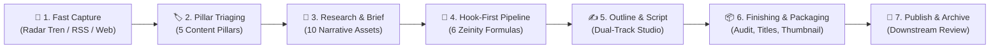

<div align="center">


# 🎬 Zeinity Creator Assistant

**AI-Powered Spoken-First Narrative & Video Production Studio for YouTube Creators**

[](https://github.com/zenqyverse/zeinity-creator-assistants)
[](test/)
[](https://react.dev/)
[](https://www.typescriptlang.org/)
[](https://vitejs.dev/)
[](https://tailwindcss.com/)
[](https://supabase.com/)

[**English**](README.md) &bull; [**Bahasa Indonesia**](README.id.md)

</div>

---

> [!WARNING]
> ### ⚠️ Project Status: Under Active Development
> **Zeinity Creator Assistant is currently in active development (Alpha / Work in Progress).**
> Architectural blueprints, database schemas, and AI prompt pipelines are continuously evolving. Some features, experimental multi-agent integrations, and Edge Functions may undergo rapid iteration and breaking updates before reaching a stable v1.0 release.

---

## 📖 Overview & Philosophy

**Zeinity Creator Assistant** is a specialized content engineering studio built specifically for high-impact YouTube creators. It bridges the gap between raw idea capture, trend intelligence, rigorous narrative structuring, and complete production-ready scripts following the **Zeinity Spoken-First Narrative System**.

---

## 🔄 The Transformation: From "Prompt Generator" to "AI Content Studio"

During early development, an architectural diagnosis revealed that the application functioned merely as a static prompt middleman:
```
Creator ➔ App ➔ (Copy Prompt) ➔ External LLM ➔ (Paste Result) ➔ App ➔ (Copy Prompt) ➔ External LLM...
```
This created heavy cognitive friction—creators felt like manual data-entry clerks rather than content directors. To eliminate this bottleneck, the system underwent an **evolutionary architectural transformation**, evolving from an instruction generator into a full **Human-in-the-Loop AI Orchestrator & Co-Creation Studio**:

| Aspect | Legacy State (Prompt Generator) | Current State (Zeinity Studio Orchestrator) |
|---|---|---|
| **Core Identity** | Instruction factory / Prompt output | End-to-end video production & trend studio |
| **User Effort** | Tedious back-and-forth copy-pasting | 1-Click AI actions with in-app review, gatekeeper & approval |
| **Output Type** | Raw prompt text strings | Live drafts, structured diff audits, vector mockups, in-app revisions |
| **Scripting Flow** | External notepad or Docs | Dual-Track Studio with Hook-First pipeline, word counting & auto-save |
| **Finishing Flow** | Fragmented popups & detached checklists | Consolidated 2-Panel Master-Detail Finishing & Packaging Studio |
| **Audio Quality** | Generic written prose full of AI tropes | Strict 14 Spoken-First voiceover rules + Casual-Friendly voice coach |
| **Safety & History** | Overwrites destroyed previous work | Snapshot history modal with 1-click version rollback & offline caching |
| **UI Terminology** | "Prompts", "Generator", "Output" | **"Pipeline Naskah" (Script Pipeline)** & **"Draft Studio"** |
| **Model Control** | Static API dropdown | **Interactive Topbar Switcher & 4-Tier Auto-Fallback Chain** |

---

## 🏗️ Major Engineering Transformation Phases

### Phase 1: Data Stability & Permanent Loss Prevention
- **Isolated Component State**: Complete state isolation within `ScriptDetail.tsx` to prevent cross-content contamination when switching between ideas.
- **Destructive Action Guards**: All delete actions (deleting ideas in `ContentTable`, files in `FileManager`, or API tokens in `Settings`) are safeguarded by modal confirmation barriers (`AlertModal`).
- **Dynamic Filter Resilience**: Eliminated filter collision bugs in `ContentTable.tsx` that previously caused temporary data "blackouts".
- **Offline Resilience**: Introduced offline fallbacks in `useFiles.ts` with local memory caching.

### Phase 2: Script Continuity, AI Engine & In-App Studio
- **Unbroken Script Continuity**: Written drafts remain accessible and synchronized across all pipeline stages (Draft Studio ➔ Finishing & Packaging ➔ Published Detail) without losing edits.
- **Draft Snapshot Versioning**: Integrated a snapshot timeline allowing creators to review previous AI iterations and instantly trigger "Undo Revisi AI".
- **Dual-Title Engine (Mode A & Mode B)**: Formulates two distinct title angles complying with YouTube community standards (Curiosity & High Stakes vs Direct Transformation).
- **Bulk Ingestion Engine**: Support for bulk importing ideas from CSV, Markdown, and plain text with automatic delimiter detection and selective checkboxes.
- **Deep Context Preservation**: Creator's original idea notes (`research_text`) are automatically piped into all downstream AI prompt contexts.
- **Native Document Support**: Browser-native `.docx` parsing via Mammoth.js alongside `.md`, `.txt`, and `.csv`.
- **Local Ollama Optimization**: Adaptive context-window chunking preventing memory overflow or truncated responses on local models.

### Phase 3: Ergonomics, Production Metrics & UI Rebranding
- **UI Framing Rebrand**: Eradicated obsolete "Prompt Generator" labels. Re-framed workspace into **"Pipeline Naskah" (Script Pipeline)** and **"Draft Studio"**.
- **Synchronized Revert Navigation**: Fixed navigation router and history stack so reverting an item's status updates both the UI view and database synchronously.
- **Interactive Inline Title & Auto-Expanding Textareas**: Double-click inline title renaming and auto-resizing textareas eliminating text clipping.
- **Realistic Production Analytics**: Production duration metrics re-engineered to accurately track turnaround times from Ideation to Final Publication.

### Phase 4: Telegram Bot Webhook Blueprint *(Edge Function — Requires Deployment)*
- **Serverless Deno Webhook (Blueprint Ready)**: Supabase Edge Function (`telegram-webhook`) with secret token header authentication (`X-Telegram-Bot-Api-Secret-Token`). The function code is complete in `supabase/functions/telegram-webhook/` but requires manual deployment via `supabase functions deploy telegram-webhook`.
- **Access Whitelisting**: Strict authorization filter via `telegram_allowed_chat_ids`.
- **Realtime Table Ingestion**: Once deployed, Supabase Realtime subscriptions immediately toast incoming ideas and append rows without page reloads. Frontend Realtime listener is active in `useContent.ts`.
- **Interactive Slash Commands**: Full command suite (`/start`, `/help`, `/pillars`, `/id`, `/pipeline`, `/latest`).

### Phase 5: Hook-First Pipeline & Human Gatekeeper
- **Hook-First Architecture**: Restructured the scripting pipeline so video opening hooks (0–30s) are established *before* formulating the 5-stage narrative outline.
- **6 Zeinity Hook Formulas**:
  1. *The Provocative Question* (Pertanyaan Provokatif & Menggugat)
  2. *The Counter-Intuitive Claim* (Klaim Kontra-Intuitif / Melawan Arus)
  3. *The Hard Truth / Negative Warning* (Kebenaran Pahit & Peringatan Keras)
  4. *The Secret / Hidden Mechanism* (Membongkar Mekanisme Rahasia)
  5. *The Story / High-Stakes Narrative* (Kisah Dramatis & Taruhan Tinggi)
  6. *The Paradigm Shift* (Pergeseran Paradigma Radikal)
- **AI Recommendation Engine**: Generates 3 curated hooks with formula tags, AI recommendation badges (`Rekomendasi AI ✨`), match rationale, and confidence scores.
- **Human Gatekeeper**: The "Generate Outline 5 Tahap" action in Stage 2 is strictly disabled until the creator selects or crafts a hook, ensuring conscious narrative direction.
- **Collapsible Hook Workspace**: Collapsible accordion in `OutlineWorkspace.tsx` lets creators fold the hook card away once completed to maximize focus on the outline.
- **Compact Pre-Flight Bar (+200px Height Reclaimed)**: Redesigned the bulky pre-flight configuration into a sleek status pill strip with an interactive `⚙ Setelan` modal and non-destructive stage revert.

### Phase 6: Consolidated Finishing & Packaging Studio & Casual Audio Polish
- **Consolidated 2-Workflow Tabs**: Streamlined `ScriptDetail.tsx` workflow tabs from 3 fragmented tabs to **2 Primary Workspaces**:
  1. `✍️ 1. Studio Naskah` (Focus on Hook-First pipeline, outline drafting, and full scriptwriting canvas).
  2. `📦 2. FINISHING & PACKAGING` (Consolidated Spoken Audit, 5 Title Formulas, and Inline Thumbnail Studio).
- **2-Panel Master-Detail Layout**:
  - **Left Panel (Production Stepper & Progress)**:
    - Progress Bar: *"Progres Packaging: X dari 3 Selesai (Y%)"*.
    - 3 Dynamic Stepper Cards replacing the legacy redundant bottom checklist:
      - *Card 1: 1. Audit Spoken & TTS* (Status SELESAI / PERLU AUDIT, findings counter).
      - *Card 2: 2. 5 Formula Judul* (Status JUDUL TERPILIH / 5 VARIAN SIAP, active title preview, mobile-safe badge).
      - *Card 3: 3. Studio Thumbnail* (Status SEDANG AKTIF / SIAP, 16:9 ratio, hook text preview).
    - Quick navigation: *"Kembali ke Studio Naskah"*.
  - **Right Panel (Dedicated Sub-Studio Canvas)**:
    - **Sub-Studio 1 (Audit Spoken & TTS)**:
      - Interactive Diff Cards: `BAGIAN ASLI` vs `REVISI SPOKEN / TTS` with clear problem diagnoses and voiceover rationale.
      - 1-Click *"Terapkan Revisi ke Draf Naskah"*.
      - **Sub-Sesi Poles Kasual Friendly**: Dedicated sub-session (`runCasualAudit`) that transforms formal/academic/textbook prose into warm, conversational, friendly peer dialogue without slang/alay or TTS punctuation violations (`—` and `:` banned).
      - Sequential navigation: *"Lanjut ke 5 Formula Judul ➔"*.
    - **Sub-Studio 2 (5 Formula Judul Zeinity)**:
      - 5 Zeinity Hook Title Formulas (*Curiosity & High Stakes*, *Direct Transformation*, *Contrarian Belief*, *Numerical Proof*, *The Big Question*).
      - Active title highlight badge (`Judul Utama Aktif ✓`) and 1-click *"Gunakan sbg Judul"*.
      - Sequential navigation: *"Lanjut ke Studio Thumbnail ➔"*.
    - **Sub-Studio 3 (Inline Studio Thumbnail & SVG Canvas)**:
      - Inline 2-column layout (no floating modal popup).
      - Left: Uppercase hook text input with character counter & 4 instant presets (`ILUSI DIBONGKAR`, `FAKTA TERSEMBUNYI`, `JEBAKAN SISTEM`, `AKHIRNYA TERUNGKAP`), aspect ratio switcher (`16:9`, `1:1`, `9:16`), image provider dropdown, Midjourney prompt textarea with copy/regenerate.
      - Right: Client-side interactive SVG vector mockup canvas (0 token, 0 API cost), Safe Zone 80% boundary guide, Standar Mutu Thumbnail Bab 13 checklist, and *"Unduh Mockup SVG (Vektor HD)"* button.
      - Hero Footer Bar: Primary action *"Tandai Siap Publikasi / Publish ➔"* for direct transition to Published status.

### Phase 7: Content Intelligence (Radar Tren & RSS Reader Studio)
- **🔥 Radar Tren & Sinyal Konten**:
  - Real-time monitoring of YouTube Most Popular videos via YouTube Data API v3 and Google Daily Search Trends via RSS XML feeds.
  - Regional filtering (`ID` Indonesia & `US` Global) and YouTube category filters.
  - Independent per-tab data refresh logic.
  - 1-Click **⚡ Tambah ke Ide** instant capture with title duplicate detection and toast feedback.
  - Overview Dashboard widget **Radar Sinyal Terhangat** displaying top 3 trending topics at a glance.
- **📰 RSS Reader Studio & Agregator Kurasi**:
  - News aggregator across 4 category tabs (*Media & Berita*, *Blog Teknologi & AI*, *Forum & Komunitas*, *Koleksi Saya*) mapped to Zeinity's 5 Content Pillars.
  - Progressive loading (*Muat Lebih Banyak* +10 items) and lazy category fetching.
  - Full RSS Feed Manager (CRUD): Add, inline **Edit (✏️)**, permanent **Delete (🗑️)**, and **Aktif/Nonaktif** toggling with Supabase migration `20261001150000_create_rss_sources_table.sql` and deletion resilience.
  - Robust XML parsing: CDATA unwrapping, HTML/numeric entity decoding, and OpenGraph image scraper fallback with 1x1 tracking pixel exclusion.
  - Compact, mobile-friendly Read / Unread status toggle (`markItemAsUnread` & `toggleItemRead`).
  - Comprehensive discovery guide: [📡 Panduan Mencari & Menggunakan Link RSS Feed](docs/PANDUAN_MENCARI_RSS.md).
- **Navigation Repositioning**:
  - "Radar Tren" and "RSS Reader" positioned in the Sidebar directly beneath "Published", aligning ideation feeds cleanly with the production lifecycle.

### 🛡️ AI Router Resilience & 100% 9Router Gateway
- **9Router Gateway Integration**: Full native support for local OpenAI-compatible gateway (`http://localhost:20128/v1`).
- **9Remote & Cloud Deployment Support**: First-class support for deployed cloud applications (Vercel, Netlify, Cloudflare Pages) connecting to remote 9Router instances via CORS-safe public tunnels (`abc-tunnel.us` or direct Cloudflare tunnels). Features automatic origin detection (`window.location.hostname !== 'localhost'`) that seamlessly switches from localhost URLs to remote tunnel endpoints.
- **Combo Presets vs Specific Models**: Switch between curated multi-model blends (`Creator-Combo`, `Jarvis_Creator`) and grouped individual models (Groq Llama 3.3 70B, Google Gemini 2.0 Flash, DeepSeek, etc.).
- **Multi-Provider Auto-Fallback Chain**: Dynamic 4-tier failover (`9Router Gateway` ➔ `Google Gemini` ➔ `OpenRouter` ➔ `Local Ollama`). If any provider hits rate-limits or network failure, the engine automatically rolls over to the next provider while streaming progress logs to the Terminal drawer.
- **Topbar 1-Click AI Switcher**: Interactive header widget providing instant model switching, provider latency status, and direct shortcut to Settings without leaving your writing flow.

---

## ⚡ Core Features

- **🚀 Dual-Track Scriptwriter Studio**:
  - *Track A (In-App AI Studio)*: Configure target word counts (preset 8–12 min, ~1,300–1,950 words or custom), generate section-by-section narrative outlines, approve outlines through a human gate, and draft full scripts directly inside the application.
  - *Track B (External Handoff)*: 1-click zero-token prompt generator packaged for external frontier models (Claude 3.5 Sonnet, ChatGPT, DeepSeek).
- **🎯 Hook-First Narrative Engine**:
  - 6 Zeinity Hook Formulas with AI recommendations, scoring, and human gatekeeper enforcement.
- **📦 Consolidated Finishing & Packaging Studio**:
  - 2-Panel Master-Detail workspace combining Spoken & Casual Audit, 5 Title Formulas, and Inline Thumbnail Studio.
- **🎙️ Dual-Stage Audio & Voiceover Polish**:
  - Stage 1: 14 Spoken-First Voiceover Rules & TTS prosody audit with interactive diff cards.
  - Stage 2: Casual-Friendly tone transformation sub-session.
- **🖼️ Inline Thumbnail Studio & SVG Vector Canvas**:
  - Live client-side SVG mockup preview, 80% safe zone overlay, Bab 13 quality checklist, HD SVG export, and direct publishing transition.
- **🔥 Radar Tren & Sinyal Konten**:
  - YouTube Data API v3 & Google Daily Search Trends integration with 1-click idea capture.
- **📰 RSS Reader Studio & Agregator Kurasi**:
  - 4-category news aggregator mapped to Zeinity pillars with full feed CRUD and OpenGraph image fallback.
- **🔄 Multi-AI Provider Gateway & Fallback**:
  - 9Router Gateway (`custom`), Google Gemini SDK, OpenRouter REST API, Local Ollama API with dynamic 4-tier failover.
- **🛡️ Hybrid Offline/Cloud Architecture**:
  - Zero-setup local operation via `localStorage` with optional Supabase PostgreSQL sync.
- **📱 Telegram Bot Fast Capture** *(Requires Edge Function Deployment)*:
  - Mobile idea capture via Telegram slash commands with real-time web sync.

---

## 📋 Daily SOP (Standard Operating Procedure)

This daily workflow guides creators from fleeting thought to published, high-retention video:



### Phase 1: Fast Idea Capture (Radar, RSS, or Telegram)
- **From Trends & RSS**: Browse **Radar Tren** or **RSS Reader Studio**, click **⚡ Tambah ke Ide** to instantly ingest topics into the pipeline.
- **On Mobile**: Send thoughts or voice note transcripts directly to your linked **Telegram Bot**.
- **On Desktop**: Open the web app, click `+ Tambah Ide`, enter the title, and assign source tags.

### Phase 2: Triase & Pillar Classification
- In **Pipeline Naskah**, classify the idea into one of the 5 Zeinity Content Pillars:
  1. *AI Automation* (Workflows, Agentic AI, Autonomous systems)
  2. *Future Tech* (Emerging paradigms, Computing, Robotics)
  3. *System Thinking* (Mental models, Optimization, Feedback loops)
  4. *Digital Leverage* (Media, Code, Scalable distribution)
  5. *Deep Work* (Focus, High-cognitive output, Craftsmanship)
- Click **Buka Studio** to enter the workspace.

### Phase 3: Research Ingestion & Brief Generation
- Drop reference documents (`.docx`, `.pdf`, `.md`, or `.txt`) into the **Dropzone Riset**.
- Click **Ekstrak & Analisis Riset** to generate 10 Narrative Assets and fact-checking boundaries.

### Phase 4: Hook-First Formulation
- In **Studio Naskah**, examine the 6 Zeinity Hook Formulas.
- Click **Generate Rekomendasi Hook** to review AI suggestions with confidence scores and rationale.
- Select or customize the opening hook (0–30s) to unlock Stage 2.

### Phase 5: Outline Drafting & Dual-Track Scriptwriting
1. Select target word count preset or configure custom minutes in the compact Pre-Flight Bar.
2. Click **Generate Outline 5 Tahap** to formulate escalating narrative sections.
3. Review and approve the outline through the **Human Gatekeeper** (`Setujui Outline`).
4. Draft the script:
   - **In-App Studio**: Generate per-beat or full draft with live word count and auto-save.
   - **External Handoff**: 1-click copy zero-token prompt for Claude 3.5 Sonnet or ChatGPT.

### Phase 6: Finishing & Packaging Studio (Tab 2)
1. Switch to **FINISHING & PACKAGING**:
2. **Sub-Studio 1 (Audit Spoken & TTS)**:
   - Run the Spoken Audit to inspect interactive diff cards (`BAGIAN ASLI` vs `REVISI SPOKEN / TTS`).
   - Run the **Sub-Sesi Kasual Friendly** to soften academic phrasing into warm conversation.
   - Click **Terapkan Revisi ke Draf Naskah**.
3. **Sub-Studio 2 (5 Formula Judul)**:
   - Generate 5 Zeinity hook title variants.
   - Click **Gunakan sbg Judul** to set the mobile-safe winner.
4. **Sub-Studio 3 (Studio Thumbnail)**:
   - Input 2–4 word uppercase hook text or select preset chips (`ILUSI DIBONGKAR`, `FAKTA TERSEMBUNYI`, etc.).
   - Review live SVG vector canvas mockup with 80% safe zone overlay.
   - Export SVG vector HD mockup.
   - Click **Tandai Siap Publikasi / Publish ➔**.

### Phase 7: Publish & Archive
- Move the video to **Arsip Produksi** and review throughput analytics.

---

## 🛠️ Tech Stack

| Layer | Technologies |
|---|---|
| **Frontend Core** | React 18.3, TypeScript 5.5, Vite 5.4 |
| **Styling** | Tailwind CSS 3.4, Vanilla CSS Variables, Glassmorphism design tokens |
| **Icons & UI** | Lucide React, Custom SVG glowing indicators |
| **Document Processing** | Mammoth.js (`.docx` parser), FileReader API |
| **State & Offline Storage** | Browser LocalStorage, In-memory reactive state |
| **Backend & Realtime** | Supabase (PostgreSQL 15, Row Level Security, Edge Functions) |
| **AI Inference & Routing** | 9Router Gateway (`http://localhost:20128/v1`), Google Gemini SDK, OpenRouter REST API, Local Ollama API |
| **Testing** | Node.js native test runner (`node:test`, `node:assert/strict`) — **238 Tests / 36 Suites** |

---

## 🚀 Getting Started & Setup Guide

### 1. Prerequisites
Ensure you have the following installed on your machine:
- **Node.js**: v18.0.0 or higher ([Download Node.js](https://nodejs.org/))
- **npm** (bundled with Node) or **pnpm** / **yarn**
- **Git** ([Download Git](https://git-scm.com/))
- *(Optional)* **9Router** or **Ollama** ([Download Ollama](https://ollama.com/)) for local/remote AI execution.

### 2. Clone the Repository
```bash
git clone https://github.com/zenqyverse/zeinity-creator-assistants.git
cd zeinity-creator-assistants
```

### 3. Install Dependencies
```bash
npm install
```

### 4. Configure Environment Variables
Copy `.env.example` to create your local `.env`:
```bash
cp .env.example .env
```

Fill in your configuration keys (all optional; runs in Safe Offline Mode if left blank):
```env
# Supabase Configuration (Optional - leave blank for local offline mode)
VITE_SUPABASE_URL=https://your-project-id.supabase.co
VITE_SUPABASE_ANON_KEY=your-anon-public-key

# Google Gemini API Key (Optional - can also be configured inside Settings UI)
VITE_GEMINI_API_KEY=your_gemini_api_key_here

# 9Router AI Gateway - Remote Deployment (Optional - for Vercel/Netlify hosting)
VITE_CUSTOM_GATEWAY_ENDPOINT=https://rje2m9z.abc-tunnel.us/v1
VITE_CUSTOM_GATEWAY_API_KEY=sk-your-9router-api-key
```

### 5. Start the Development Server
```bash
npm run dev
```
Open your browser and navigate to `http://localhost:5173`.

### 6. Run Automated Tests
Execute the 238 verification tests across 36 test suites:
```bash
npm test
```

### 7. Build for Production
```bash
npm run build
npm run preview
```

---

## 🤖 Optional: Local & Remote AI Setup (9Router & Ollama)

### A. 9Router Gateway & 9Remote
1. **Local Mode**: Launch your 9Router server locally on port `20128`:
   ```bash
   # Default endpoint: http://localhost:20128/v1
   ```
2. **Remote Mode (9Remote / Cloudflare Tunnel)**:
   - When deploying to cloud hosts (Vercel / Netlify / Cloudflare Pages), use 9Router's CORS-safe public tunnel endpoint (e.g., `https://rje2m9z.abc-tunnel.us/v1`).
   - The app detects non-localhost origins automatically and prioritizes the remote tunnel endpoint.
   - Quick preset buttons for **Default Lokal**, **9Router Remote**, and **Cloudflare Direct Tunnel** are available under **Settings** (`/settings`).
3. The application automatically selects **`custom` (9Router Gateway)** as the default active provider with model `Creator-Combo`.

### B. Ollama (100% Offline & Free)
1. Install Ollama from [ollama.com](https://ollama.com/).
2. Pull a recommended model:
   ```bash
   ollama run llama3:8b
   # or
   ollama run qwen2.5:7b
   ```
3. Open Zeinity Creator Assistant, navigate to **Settings** (`/settings`), set Provider to **Ollama (Lokal)**, and confirm endpoint `http://localhost:11434`.

---

## 📁 Repository Structure

```
zeinity-creator-assistants/
├── docs/                               # System documentation & PRDs
│   ├── architecture/                   # Infrastructure & Telegram specs
│   ├── blueprints/                     # Multi-AI blueprints & prompt plans
│   ├── reports/                        # Executive audit reports & diagnosis
│   └── strategy/                       # YouTube channel strategy & spoken-first rules
├── public/                             # Static assets (official logo, banner, favicons)
├── scripts/                            # Maintenance & audit utilities
├── src/                                # React application source code
│   ├── assets/                         # Application branding assets
│   ├── components/                     # Reusable UI components (Sidebar, Topbar, Modals, Script studio)
│   ├── hooks/                          # Custom hooks (useContent, useSettings, useFiles)
│   ├── lib/                            # AI engine (gemini.ts), Supabase client, parsers, RSS
│   ├── views/                          # Main views (Overview, ContentTable, ScriptDetail, TrendRadar, RSSReader, Settings)
│   ├── App.tsx                         # App entry & routing
│   ├── index.css                       # Glassmorphism styling & animations
│   ├── main.tsx                        # DOM mount
│   └── types.ts                        # TypeScript interfaces & domain types
├── supabase/                           # Supabase configurations
│   ├── functions/                      # Deno Edge Functions (telegram-webhook)
│   └── migrations/                     # SQL migration scripts & RLS policies
├── test/                               # Automated test suites (238 tests in 36 suites)
├── vercel.json                         # Vercel SPA routing rewrite configuration
├── .env.example                        # Example environment template
├── .gitignore                          # Ignored directories & files
├── package.json                        # Project metadata & scripts
├── tsconfig.json                       # TypeScript compiler options
└── vite.config.ts                      # Vite build configuration
```

---

## 🗺️ Development Roadmap

- [x] Full Human-in-the-Loop 5-Stage Content Pipeline
- [x] Hook-First Scripting Pipeline with 6 Zeinity Formulas & Human Gatekeeper
- [x] Dual-Track In-App AI Scriptwriter & External Handoff
- [x] 14 Spoken-First Voiceover & TTS Rules Enforcement
- [x] Sub-Session Casual-Friendly Voiceover Polish (`runCasualAudit`)
- [x] Consolidated 2-Panel Master-Detail Finishing & Packaging Studio
- [x] Inline SVG Vector Thumbnail Mockup Canvas & 80% Safe Zone Overlay
- [x] Radar Tren (YouTube Data API v3 & Google Search Trends XML)
- [x] RSS Reader Studio with Feed CRUD, OpenGraph Fallback & Read/Unread Toggles
- [x] 9Router Multi-Model Gateway & Multi-Provider Failover with 9Remote Cloud Support
- [x] Topbar 1-Click Interactive AI Model Switcher
- [x] Safe Offline Mode (LocalStorage Fallback) & Snapshot History
- [x] Bulk Ingestion (CSV, Markdown, Plain Text)
- [x] Comprehensive 128-Button Audit Resolution & Vercel SPA Rewrite
- [~] Telegram Bot Idea Capture *(Edge Function code complete — manual deployment required; frontend Realtime listener active)*
- [ ] Direct YouTube Data API integration for auto-publishing metadata
- [ ] ElevenLabs / Edge-TTS audio preview synthesis directly inside Studio
- [ ] Export to Teleprompter / Final Draft `.fdx` format

---

## 📄 License & Attribution

This project is licensed under the [MIT License](LICENSE).

Developed with ❤️ for the **Zeinity Creator Ecosystem**.
