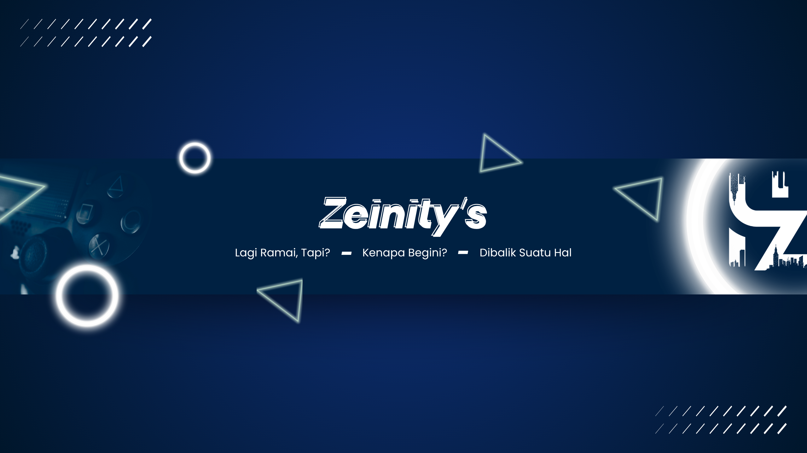
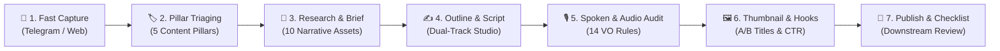

<div align="center">



# 🎬 Zeinity Creator Assistant

**AI-Powered Spoken-First Narrative & Video Production Studio for YouTube Creators**

[](https://github.com/zenqyverse/zeinity-creator-assistants)
[](test/)
[](https://react.dev/)
[](https://www.typescriptlang.org/)
[](https://vitejs.dev/)
[](https://tailwindcss.com/)
[](https://supabase.com/)

[**English**](README.md) &bull; [**Bahasa Indonesia**](README.id.md)

</div>

---

> [!WARNING]
> ### ⚠️ Project Status: Under Active Development
> **Zeinity Creator Assistant is currently in active development (Alpha / Work in Progress).**
> Architectural blueprints, database schemas, and AI prompt pipelines are continuously evolving. Some features, experimental multi-agent integrations, and Edge Functions may undergo rapid iteration and breaking updates before reaching a stable v1.0 release.

---

## 📖 Overview & Philosophy

**Zeinity Creator Assistant** is a specialized content engineering studio built specifically for high-impact YouTube creators. It bridges the gap between raw idea capture, rigorous narrative structuring, and complete production-ready scripts following the **Zeinity Spoken-First Narrative System**.

---

## 🔄 The Transformation: From "Prompt Generator" to "AI Content Studio"

During early development, an architectural diagnosis revealed that the application functioned merely as a static prompt middleman:
```
Creator ➔ App ➔ (Copy Prompt) ➔ External LLM ➔ (Paste Result) ➔ App ➔ (Copy Prompt) ➔ External LLM...
```
This created heavy cognitive friction—creators felt like manual data-entry clerks rather than content directors. To eliminate this bottleneck, the system underwent a **massive 4-phase architectural transformation**, evolving from an instruction generator into a full **Human-in-the-Loop AI Orchestrator & Co-Creation Studio**:

| Aspect | Legacy State (Prompt Generator) | Current State (Zeinity Studio Orchestrator) |
|---|---|---|
| **Core Identity** | Instruction factory / Prompt output | End-to-end video production studio |
| **User Effort** | Tedious back-and-forth copy-pasting | 1-Click AI actions with in-app review & approval |
| **Output Type** | Raw prompt text strings | Live drafts, structured audits, in-app revisions |
| **Scripting Flow** | External notepad or Docs | Dual-Track Studio with real-time word counting & auto-save |
| **Audio Quality** | Generic written prose full of AI tropes | Strict 14 Spoken-First voiceover rules & TTS audit |
| **Safety & History** | Overwrites destroyed previous work | Snapshot history modal with 1-click version rollback |
| **UI Terminology** | "Prompts", "Generator", "Output" | **"Pipeline Naskah" (Script Pipeline)** & **"Draft Studio"** |
| **Model Control** | Static API dropdown | **Interactive Topbar Switcher & 4-Tier Auto-Fallback Chain** |

---

## 🏗️ The 4 Major Engineering Transformation Phases

### Phase 1: Data Stability & Permanent Loss Prevention
- **Isolated Component State**: Complete state isolation within `ScriptDetail.tsx` to prevent cross-content contamination when switching between ideas.
- **Destructive Action Guards**: All delete actions (deleting ideas in `ContentTable`, files in `FileManager`, or API tokens in `Settings`) are safeguarded by modal confirmation barriers (`AlertModal`).
- **Dynamic Filter Resilience**: Eliminated filter collision bugs in `ContentTable.tsx` that previously caused temporary data "blackouts".
- **Offline Resilience**: Introduced offline fallbacks in `useFiles.ts` with local memory caching.

### Phase 2: Script Continuity, AI Engine & In-App Studio
- **Unbroken Script Continuity**: Written drafts remain accessible and synchronized across all pipeline stages (Draft Studio ➔ Thumbnailing ➔ Published Detail) without losing edits.
- **Draft Snapshot Versioning**: Integrated a snapshot timeline allowing creators to review previous AI iterations and instantly trigger "Undo Revisi AI".
- **Dual-Title Engine (Mode A & Mode B)**: Formulates two distinct title angles complying with YouTube community standards (Curiosity & High Stakes vs Direct Transformation).
- **Bulk Ingestion Engine**: Support for bulk importing ideas from CSV, Markdown, and plain text with automatic delimiter detection and selective checkboxes.
- **Deep Context Preservation**: Creator's original idea notes (`research_text`) are automatically piped into all downstream AI prompt contexts.
- **Native Document Support**: Browser-native `.docx` parsing via Mammoth.js alongside `.md`, `.txt`, and `.csv`.
- **Local Ollama Optimization**: Adaptive context-window chunking preventing memory overflow or truncated responses on local models.

### Phase 3: Ergonomics, Production Metrics & UI Rebranding
- **UI Framing Rebrand**: Eradicated obsolete "Prompt Generator" labels. Re-framed workspace into **"Pipeline Naskah" (Script Pipeline)** and **"Draft Studio"**.
- **Synchronized Revert Navigation**: Fixed navigation router and history stack so reverting an item's status updates both the UI view and database synchronously.
- **Interactive Inline Title & Auto-Expanding Textareas**: Double-click inline title renaming and auto-resizing textareas eliminating text clipping.
- **Realistic Production Analytics**: Production duration metrics re-engineered to accurately track turnaround times from Ideation to Final Publication.

### Phase 4: Telegram Bot Webhook Blueprint *(Edge Function — Requires Deployment)*
- **Serverless Deno Webhook (Blueprint Ready)**: Supabase Edge Function (`telegram-webhook`) with secret token header authentication (`X-Telegram-Bot-Api-Secret-Token`). The function code is complete in `supabase/functions/telegram-webhook/` but requires manual deployment via `supabase functions deploy telegram-webhook`.
- **Access Whitelisting**: Strict authorization filter via `telegram_allowed_chat_ids`.
- **Realtime Table Ingestion**: Once deployed, Supabase Realtime subscriptions immediately toast incoming ideas and append rows without page reloads. Frontend Realtime listener is active in `useContent.ts`.
- **Interactive Slash Commands**: Full command suite (`/start`, `/help`, `/pillars`, `/id`, `/pipeline`, `/latest`).

### 🛡️ AI Router Resilience & 100% 9Router Gateway
- **9Router Gateway Integration**: Full native support for local OpenAI-compatible gateway (`http://localhost:20128/v1`).
- **9Remote & Cloud Deployment Support**: First-class support for deployed cloud applications (Vercel, Netlify, Cloudflare Pages) connecting to remote 9Router instances via CORS-safe public tunnels (`abc-tunnel.us` or direct Cloudflare tunnels). Features automatic origin detection (`window.location.hostname !== 'localhost'`) that seamlessly switches from stale localhost URLs to remote tunnel endpoints.
- **Combo Presets vs Specific Models**: Switch between curated multi-model blends (e.g., `Creator-Combo`, `Jarvis_Creator`) and grouped individual models (Groq Llama 3.3 70B, Google Gemini 2.0 Flash, DeepSeek, etc.).
- **Multi-Provider Auto-Fallback Chain**: Dynamic 4-tier failover (`9Router Gateway` ➔ `Google Gemini` ➔ `OpenRouter` ➔ `Local Ollama`). If any provider hits rate-limits or network failure, the engine automatically rolls over to the next provider while streaming progress logs to the Terminal drawer.
- **Topbar 1-Click AI Switcher**: Interactive header widget providing instant model switching, provider latency status, and direct shortcut to Settings without leaving your writing flow.

### 🔍 Frontend Button Audit Resolution
A complete audit of **128 button elements** across the frontend was executed:
- **Zero Zombie UI**: All non-functional placeholder elements were either connected to live state or gracefully removed.
- **Accidental Submit Prevention**: Explicit `type="button"` attributes applied across all buttons, preventing inadvertent form submission and sudden page reloads.

---

## ⚡ Core Features

- **🚀 Dual-Track Scriptwriter Studio**:
  - *Track A (In-App AI Studio)*: Configure target word counts (preset 8–12 min, ~1,300–1,950 words or custom), generate section-by-section narrative outlines, approve outlines through a human gate, and draft full scripts directly inside the application.
  - *Track B (External Handoff)*: 1-click zero-token prompt generator packaged for external frontier models (Claude 3.5 Sonnet, ChatGPT, DeepSeek).
- **🧠 6 Specialized Prompt & Scripting Engines**:
  1. *Research Brief Prompt*: Extracts 10 Narrative Assets, claims, and verification boundaries from uploaded source documents.
  2. *Script Outline Prompt*: Formulates 5 distinct narrative stages with clear escalation arcs.
  3. *Scriptwriter Brief Prompt*: Embeds speaker persona and enforces 14 spoken-first Voiceover rules.
  4. *Spoken & TTS Audio Audit*: Analyzes drafted scripts across 4 dimensions with a structured audit report (`ORIGINAL -> ISSUE -> REVISION -> REASON`).
  5. *5-Formula Hook Title Recommendations*: Generates 5 Zeinity-formula title variants with copy/apply actions for A/B testing.
  6. *Thumbnail & Hook Copy Engine*: Produces 3 high-CTR concepts, stakes vs. question framing, and 2–4 word high-contrast visual text.
- **🔄 Multi-AI Provider Gateway & Fallback**:
  - **9Router Gateway (`custom`)**: Local gateway (`http://localhost:20128/v1`) with Combo presets and Direct models.
  - **Google Gemini**: Native API integration (`gemini-1.5-flash`, `gemini-1.5-pro`).
  - **OpenRouter**: Access Claude 3.5 Sonnet, DeepSeek V3/R1, Llama 3, and more.
  - **Local Ollama**: 100% offline, zero-cost, private local inference (`http://localhost:11434`) with automatic context-window optimization.
- **🛡️ Hybrid Offline/Cloud Architecture**:
  - *Safe Offline Mode*: Zero-setup local operation using browser `localStorage` and memory caching. No cloud account required to start.
  - *Supabase Cloud Sync*: Optional PostgreSQL backend with Realtime Subscriptions for seamless team synchronization.
- **📱 Telegram Bot Fast Capture** *(Requires Edge Function Deployment)*:
  - Ingest raw video ideas on-the-go via Telegram with slash commands (`/start`, `/help`, `/pillars`, `/pipeline`, `/latest`).
  - Webhooks trigger instant desktop notifications and real-time dashboard updates — once the `telegram-webhook` Edge Function is deployed to Supabase. See `supabase/MIGRATION.md` for setup instructions.
- **📂 Document Parsing & File Dropzone**:
  - In-browser parsing of `.docx` (via Mammoth), `.md`, `.txt`, and `.csv` files.
  - Permanent file repository and research attachment support.
- **🎨 Premium Glassmorphism UI & Official Branding**:
  - Cyberpunk-inspired indigo and deep-space blue gradients, blurred glass overlays, responsive data table, collapsible floating terminal drawer for real-time AI logs, and official Zeinity branding assets.

---

## 📋 Daily SOP (Standard Operating Procedure)

This daily workflow guides creators from fleeting thought to published, high-retention video:



### Phase 1: Fast Idea Capture (Mobile or Desktop)
- **On Mobile**: Send a voice note transcript or quick thought directly to your linked **Telegram Bot**. The bot replies with a confirmation and categorizes it under the `Idea` stage.
- **On Desktop**: Open the web app, press `+ Tambah Ide`, enter the title, and select a source tag (`Web` or `Telegram`).

### Phase 2: Triase & Pillar Classification
- In the **Pipeline Naskah** view, locate the idea and assign one of the 5 Zeinity Content Pillars:
  1. *AI Automation* (Workflows, Agentic AI, Autonomous systems)
  2. *Future Tech* (Emerging paradigms, Computing, Robotics)
  3. *System Thinking* (Mental models, Optimization, Feedback loops)
  4. *Digital Leverage* (Media, Code, Scalable distribution)
  5. *Deep Work* (Focus, High-cognitive output, Craftsmanship)
- Click **Buka Studio** to enter the workspace.

### Phase 3: Research Ingestion & Brief Generation
- Drop reference documents (`.docx`, `.pdf`, `.md`, or `.txt`) into the **Dropzone Riset**.
- Click **Ekstrak & Analisis Riset**. The AI analyzes the text and produces the **Research Brief** containing:
  - 10 Narrative Assets (core thesis, counter-intuitive premise, evidence, stakes).
  - Fact-checking & verification boundaries.

### Phase 4: Outline Drafting & Dual-Track Scriptwriting
1. In the **Scripting** tab, select a target word count preset (e.g., `8-12 Menit (~1,300 - 1,950 kata)`).
2. Choose your active AI model directly from the **Topbar Switcher** (e.g., `Creator-Combo` or `Google Gemini`).
3. Click **Generate Outline** to generate 5 escalating narrative sections:
   - *Hook & Premise Deconstruction*
   - *The Conventional (Wrong) Assumption*
   - *The Core Revelation / Mechanism*
   - *Tactical Implementation & Nuance*
   - *Philosophical Conclusion & Action Step*
4. Review and edit the outline directly in the text editor. Once satisfied, click **Setujui Outline (Approve Gate)**.
5. Choose your drafting track:
   - **In-App Studio**: Click **Tulis Naskah via AI** to draft section by section with live word count tracking and auto-save.
   - **External Handoff**: Click **Salin Prompt Scriptwriter** to copy the full zero-token prompt into Claude 3.5 Sonnet or ChatGPT.

### Phase 5: Spoken & Voiceover Audio Audit
- Click **Audit Naskah (Spoken & TTS)**.
- The engine scans the script against the 14 voiceover rules:
  - Eliminates long em dashes (`—`) and colons (`:`) that break speech synthesizer cadence.
  - Strips AI clichés ("Let's dive into...", "In an ever-evolving world...").
  - Identifies breathless compound sentences and proposes short, punchy spoken alternatives.
- Apply revisions with one click or review the before/after comparisons.

### Phase 6: Thumbnail Concepts & A/B Titles
- Advance to the **Thumbnailing** workspace.
- Click **Generate Konsep Thumbnail & Judul**.
- Review the outputs:
  - **Judul Mode A (Curiosity / High Stakes)** & **Judul Mode B (Direct Benefit / Transformation)**.
  - 3 Thumbnail concepts with clear Visual Contrast, Subject Placement, and 2–4 Word Text Hooks.
  - Functional Visual Cues (`[BUKTI]`, `[JELASKAN]`, `[KONTEKS]`, `[TEKANKAN]`, `[RITME]`) to streamline editing in Premiere Pro / DaVinci Resolve.

### Phase 7: Final Checklist & Archive
- Verify the **Smart Production Checklist** (Script read-aloud completed, B-roll tagged, thumbnail designed).
- Click **Tandai Selesai (Publish)** to move the video into **Arsip Produksi** and update throughput analytics.

---

## 🛠️ Tech Stack

| Layer | Technologies |
|---|---|
| **Frontend Core** | React 18.3, TypeScript 5.5, Vite 5.4 |
| **Styling** | Tailwind CSS 3.4, Vanilla CSS Variables, Glassmorphism design tokens |
| **Icons & UI** | Lucide React, Custom SVG glowing indicators |
| **Document Processing** | Mammoth.js (`.docx` parser), FileReader API |
| **State & Offline Storage** | Browser LocalStorage, In-memory reactive state |
| **Backend & Realtime** | Supabase (PostgreSQL 15, Row Level Security, Edge Functions) |
| **AI Inference & Routing** | 9Router Gateway (`http://localhost:20128/v1`), Google Gemini SDK, OpenRouter REST API, Local Ollama API |
| **Testing** | Node.js native test runner (`node:test`, `node:assert/strict`) — **199 Tests / 32 Suites** |

---

## 🚀 Getting Started & Setup Guide

### 1. Prerequisites
Ensure you have the following installed on your machine:
- **Node.js**: v18.0.0 or higher ([Download Node.js](https://nodejs.org/))
- **npm** (bundled with Node) or **pnpm** / **yarn**
- **Git** ([Download Git](https://git-scm.com/))
- *(Optional)* **9Router** or **Ollama** ([Download Ollama](https://ollama.com/)) for local/remote AI execution.

### 2. Clone the Repository
```bash
git clone https://github.com/zenqyverse/zeinity-creator-assistants.git
cd zeinity-creator-assistants
```

### 3. Install Dependencies
```bash
npm install
```

### 4. Configure Environment Variables
Copy the `.env.example` file to create your local `.env`:
```bash
cp .env.example .env
```

Open `.env` and fill in your keys (all keys are optional; the app works in Safe Offline Mode if left blank):
```env
# Supabase Configuration (Optional - leave blank for local offline mode)
VITE_SUPABASE_URL=https://your-project-id.supabase.co
VITE_SUPABASE_ANON_KEY=your-anon-public-key

# Google Gemini API Key (Optional - can also be configured inside Settings UI)
VITE_GEMINI_API_KEY=your_gemini_api_key_here

# 9Router AI Gateway - Remote Deployment (Optional - for Vercel/Netlify hosting)
VITE_CUSTOM_GATEWAY_ENDPOINT=https://rje2m9z.abc-tunnel.us/v1
VITE_CUSTOM_GATEWAY_API_KEY=sk-your-9router-api-key
```

> [!TIP]
> **API Key Security**: You do not have to write your API keys to `.env`. You can securely enter your 9Router Gateway key, Google Gemini API Key, OpenRouter Key, or Ollama endpoint directly inside the in-app **Settings** page. Keys saved via the Settings UI are isolated to your local browser storage and never transmitted to public servers.

### 5. Start the Development Server
```bash
npm run dev
```
Open your browser and navigate to `http://localhost:5173`.

### 6. Run Automated Tests
Execute the 199 verification tests across 32 test suites:
```bash
npm test
```

### 7. Build for Production
```bash
npm run build
npm run preview
```

---

## 🤖 Optional: Local & Remote AI Setup (9Router & Ollama)

### A. 9Router Gateway & 9Remote
1. **Local Mode**: Launch your 9Router server locally on port `20128`:
   ```bash
   # Default endpoint: http://localhost:20128/v1
   ```
2. **Remote Mode (9Remote / Cloudflare Tunnel)**:
   - When deploying to cloud hosts (Vercel / Netlify / Cloudflare Pages), use 9Router's CORS-safe public tunnel endpoint (e.g., `https://rje2m9z.abc-tunnel.us/v1`).
   - The app detects non-localhost origins automatically and prioritizes the remote tunnel endpoint from environment variables.
   - Quick preset buttons for **Default Lokal**, **9Router Remote**, and **Cloudflare Direct Tunnel** are available under **Settings** (`/settings`).
3. The application automatically selects **`custom` (9Router Gateway)** as the default active provider with model `Creator-Combo`.

### B. Ollama (100% Offline & Free)
1. Install Ollama from [ollama.com](https://ollama.com/).
2. Pull a recommended model:
   ```bash
   ollama run llama3:8b
   # or
   ollama run qwen2.5:7b
   ```
3. Open Zeinity Creator Assistant, go to **Settings** (`/settings`), set the Provider to **Ollama (Lokal)**, and confirm the base URL `http://localhost:11434`.

---

## 📁 Repository Structure

```
zeinity-creator-assistants/
├── docs/                               # System documentation & PRDs
│   ├── architecture/                   # Infrastructure & Telegram specs
│   ├── blueprints/                     # Multi-AI blueprints & prompt plans
│   ├── reports/                        # Executive audit reports & diagnosis
│   └── strategy/                       # YouTube channel strategy & spoken-first rules
├── public/                             # Static assets (official logo, banner, favicons)
├── scripts/                            # Maintenance & audit utilities
├── src/                                # React application source code
│   ├── assets/                         # Application branding assets
│   ├── components/                     # Reusable UI components (Sidebar, Topbar, Modals)
│   ├── hooks/                          # Custom hooks (useContent, useSettings, useFiles)
│   ├── lib/                            # AI engine (gemini.ts), Supabase client, parser
│   ├── views/                          # Main views (Overview, ContentTable, ScriptDetail, Settings)
│   ├── App.tsx                         # App entry & routing
│   ├── index.css                       # Glassmorphism styling & animations
│   ├── main.tsx                        # DOM mount
│   └── types.ts                        # TypeScript interfaces & domain types
├── supabase/                           # Supabase configurations
│   ├── functions/                      # Deno Edge Functions (telegram-webhook)
│   └── migrations/                     # SQL migration scripts & RLS policies
├── test/                               # Automated test suites (195 tests in 31 suites)
├── .env.example                        # Example environment template
├── .gitignore                          # Ignored directories & files
├── package.json                        # Project metadata & scripts
├── tsconfig.json                       # TypeScript compiler options
└── vite.config.ts                      # Vite build configuration
```

---

## 🗺️ Development Roadmap

- [x] Full Human-in-the-Loop 5-Stage Content Pipeline
- [x] Dual-Track In-App AI Scriptwriter & External Handoff
- [x] 14 Spoken-First Voiceover & TTS Rules Enforcement
- [x] 9Router Multi-Model Gateway & Multi-Provider Failover (Active — real failover implemented in `callAI`)
- [x] Topbar 1-Click Interactive AI Model Switcher
- [x] Safe Offline Mode (LocalStorage Fallback)
- [x] Snapshot History & Undo Revisi AI
- [x] Bulk Ingestion (CSV, Markdown, Plain Text)
- [x] Comprehensive 128-Button Audit Resolution
- [x] Official Zeinity Visual Branding (Banners, Logos, Favicons)
- [x] Per-Beat Script Generation (Fase 2 architectural deconstruction)
- [x] Supabase schema migration for 8 scripting/thumbnail columns (Fase 3)
- [x] Production bundle code-splitting (vendor chunks via Vite manualChunks)
- [~] Telegram Bot Idea Capture *(Edge Function code complete — manual deployment required; frontend Realtime listener active)*
- [ ] Direct YouTube Data API integration for auto-publishing metadata
- [ ] ElevenLabs / Edge-TTS audio preview synthesis directly inside Studio
- [ ] Export to Teleprompter / Final Draft `.fdx` format

---

## 📄 License & Attribution

This project is licensed under the [MIT License](LICENSE).

Developed with ❤️ for the **Zeinity Creator Ecosystem**.
