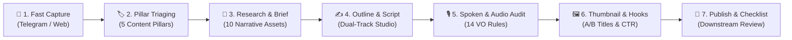

<div align="center">

# 🎬 Zeinity Creator Assistant

**AI-Powered Spoken-First Narrative & Video Production Studio for YouTube Creators**

[](https://github.com/zenqyverse/zeinity-creator-assistants)
[](https://react.dev/)
[](https://www.typescriptlang.org/)
[](https://vitejs.dev/)
[](https://tailwindcss.com/)
[](https://supabase.com/)

[**English**](README.md) &bull; [**Bahasa Indonesia**](README.id.md)

</div>

---

> [!WARNING]
> ### ⚠️ Project Status: Under Active Development
> **Zeinity Creator Assistant is currently in active development (Alpha / Work in Progress).**
> Architectural blueprints, database schemas, and AI prompt pipelines are continuously evolving. Some features, experimental multi-agent integrations, and Edge Functions may undergo rapid iteration and breaking updates before reaching a stable v1.0 release.

---

## 📖 Overview & Philosophy

**Zeinity Creator Assistant** is a specialized content engineering studio built specifically for high-impact YouTube creators. It bridges the gap between raw idea capture, rigorous narrative structuring, and complete production-ready scripts following the **Zeinity Spoken-First Narrative System**.

### Why It Is Not Just Another "Prompt Generator"
Most AI writing tools act as mere text generators that output generic, predictable prose full of robotic AI clichés ("delve", "testament", "tapestry"). Zeinity Creator Assistant is built with an uncompromising **Human-in-the-Loop (HITL)** philosophy:
1. **Curated Narrative Boundaries**: AI operates within rigid structural constraints (5-Section Escalation, Obvious Answer Deconstruction, 10 Narrative Assets).
2. **Audio-First / Voiceover Rules**: Voiceover scripts enforce 14 spoken-first rules—banning em dashes (`—`), colons (`:`), and convoluted parentheticals that disrupt conversational pacing and TTS naturalness.
3. **Dual-Track Workflow**: Creators can draft directly in the In-App Studio or export instant zero-token prompt handoffs for external LLMs (Claude 3.5 Sonnet, ChatGPT, DeepSeek).
4. **Draft Versioning & Snapshot History**: Every AI revision is isolated, allowing instant one-click revert to prevent work loss.

---

## ⚡ Core Features

- **🚀 Dual-Track Scriptwriter Studio**:
  - *Track A (In-App AI Studio)*: Configure target word counts (preset 8–12 min, ~1,300–1,950 words or custom), generate section-by-section narrative outlines, approve outlines through a human gate, and draft full scripts directly inside the application.
  - *Track B (External Handoff)*: 1-click zero-token prompt generator packaged for external frontier models.
- **🧠 6 Specialized Prompt & Scripting Engines**:
  1. *Research Brief Prompt*: Extracts 10 Narrative Assets, claims, and verification boundaries from uploaded source documents.
  2. *Script Outline Prompt*: Formulates 5 distinct narrative stages with clear escalation arcs.
  3. *Scriptwriter Brief Prompt*: Embeds speaker persona and enforces 14 spoken-first Voiceover rules.
  4. *Spoken & TTS Audio Audit*: Analyzes drafted scripts across 4 dimensions with a structured audit report (`ORIGINAL -> ISSUE -> REVISION -> REASON`).
  5. *Visual Cue Annotator*: Tags narration with functional production cues (`[BUKTI]`, `[JELASKAN]`, `[KONTEKS]`, `[TEKANKAN]`, `[RITME]`).
  6. *Thumbnail & Hook Copy Engine*: Produces 3 high-CTR concepts, stakes vs. question framing, and 2–4 word high-contrast visual text.
- **🔄 Multi-AI Provider Gateway**:
  - **Google Gemini**: Native API integration (`gemini-1.5-flash`, `gemini-1.5-pro`).
  - **OpenRouter**: Access Claude 3.5 Sonnet, DeepSeek V3/R1, Llama 3, and more.
  - **Local Ollama**: 100% offline, zero-cost, private local inference (`http://localhost:11434`) with automatic context-window optimization.
- **🛡️ Hybrid Offline/Cloud Architecture**:
  - *Safe Offline Mode*: Zero-setup local operation using browser `localStorage` and memory caching. No cloud account required to start.
  - *Supabase Cloud Sync*: Optional PostgreSQL backend with Realtime Subscriptions for seamless team synchronization.
- **📱 Telegram Bot Fast Capture**:
  - Ingest raw video ideas on-the-go via Telegram with slash commands (`/start`, `/help`, `/pillars`, `/pipeline`, `/latest`).
  - Webhooks trigger instant desktop notifications and real-time dashboard updates.
- **📂 Document Parsing & File Dropzone**:
  - In-browser parsing of `.docx` (via Mammoth), `.md`, `.txt`, and `.csv` files.
  - Permanent file repository and research attachment support.
- **🎨 Premium Glassmorphism UI**:
  - Cyberpunk-inspired indigo and deep-space blue gradients, blurred glass overlays, responsive data table, and collapsible floating terminal drawer for real-time AI logs.

---

## 📋 Daily SOP (Standard Operating Procedure)

This daily workflow guides creators from fleeting thought to published, high-retention video:



### Phase 1: Fast Idea Capture (Mobile or Desktop)
- **On Mobile**: Send a voice note transcript or quick thought directly to your linked **Telegram Bot**. The bot replies with a confirmation and categorizes it under the `Idea` stage.
- **On Desktop**: Open the web app, press `+ Tambah Ide`, enter the title, and select a source tag (`Web` or `Telegram`).

### Phase 2: Triase & Pillar Classification
- In the **Pipeline Naskah** view, locate the idea and assign one of the 5 Zeinity Content Pillars:
  1. *AI Automation* (Workflows, Agentic AI, Autonomous systems)
  2. *Future Tech* (Emerging paradigms, Computing, Robotics)
  3. *System Thinking* (Mental models, Optimization, Feedback loops)
  4. *Digital Leverage* (Media, Code, Scalable distribution)
  5. *Deep Work* (Focus, High-cognitive output, Craftsmanship)
- Click **Buka Studio** to enter the workspace.

### Phase 3: Research Ingestion & Brief Generation
- Drop reference documents (`.docx`, `.pdf`, `.md`, or `.txt`) into the **Dropzone Riset**.
- Click **Ekstrak & Analisis Riset**. The AI analyzes the text and produces the **Research Brief** containing:
  - 10 Narrative Assets (core thesis, counter-intuitive premise, evidence, stakes).
  - Fact-checking & verification boundaries.

### Phase 4: Outline Drafting & Dual-Track Scriptwriting
1. In the **Scripting** tab, select a target word count preset (e.g., `8-12 Menit (~1,300 - 1,950 kata)`).
2. Click **Generate Outline** to generate 5 escalating narrative sections:
   - *Hook & Premise Deconstruction*
   - *The Conventional (Wrong) Assumption*
   - *The Core Revelation / Mechanism*
   - *Tactical Implementation & Nuance*
   - *Philosophical Conclusion & Action Step*
3. Review and edit the outline directly in the text editor. Once satisfied, click **Setujui Outline (Approve)**.
4. Choose your drafting track:
   - **In-App Studio**: Click **Tulis Naskah via AI** to draft section by section with live word count tracking and auto-save.
   - **External Handoff**: Click **Salin Prompt Scriptwriter** to copy the full zero-token prompt into Claude 3.5 Sonnet or ChatGPT.

### Phase 5: Spoken & Voiceover Audio Audit
- Click **Audit Naskah (Spoken & TTS)**.
- The engine scans the script against the 14 voiceover rules:
  - Eliminates long em dashes (`—`) and colons (`:`) that break speech synthesizer cadence.
  - Strips AI clichés ("Let's dive into...", "In an ever-evolving world...").
  - Identifies breathless compound sentences and proposes short, punchy spoken alternatives.
- Apply revisions with one click or review the before/after comparisons.

### Phase 6: Thumbnail Concepts & A/B Titles
- Advance to the **Thumbnailing** workspace.
- Click **Generate Konsep Thumbnail & Judul**.
- Review the outputs:
  - **Judul Mode A (Curiosity / High Stakes)** & **Judul Mode B (Direct Benefit / Transformation)**.
  - 3 Thumbnail concepts with clear Visual Contrast, Subject Placement, and 2–4 Word Text Hooks.
  - Functional Visual Cues (`[BUKTI]`, `[JELASKAN]`, `[KONTEKS]`, `[TEKANKAN]`, `[RITME]`) to streamline editing in Premiere Pro / DaVinci Resolve.

### Phase 7: Final Checklist & Archive
- Verify the **Smart Production Checklist** (Script read-aloud completed, B-roll tagged, thumbnail designed).
- Click **Tandai Selesai (Publish)** to move the video into **Arsip Produksi** and update throughput analytics.

---

## 🛠️ Tech Stack

| Layer | Technologies |
|---|---|
| **Frontend Core** | React 18.3, TypeScript 5.5, Vite 5.4 |
| **Styling** | Tailwind CSS 3.4, Vanilla CSS Variables, Glassmorphism design tokens |
| **Icons & UI** | Lucide React, Custom SVG glowing indicators |
| **Document Processing** | Mammoth.js (`.docx` parser), FileReader API |
| **State & Offline Storage** | Browser LocalStorage, In-memory reactive state |
| **Backend & Realtime** | Supabase (PostgreSQL 15, Row Level Security, Edge Functions) |
| **AI Inference** | Google Generative AI SDK, OpenRouter REST API, Local Ollama API |
| **Testing** | Node.js native test runner (`node:test`, `node:assert/strict`) |

---

## 🚀 Getting Started & Setup Guide

### 1. Prerequisites
Ensure you have the following installed on your machine:
- **Node.js**: v18.0.0 or higher ([Download Node.js](https://nodejs.org/))
- **npm** (bundled with Node) or **pnpm** / **yarn**
- **Git** ([Download Git](https://git-scm.com/))
- *(Optional)* **Ollama** ([Download Ollama](https://ollama.com/)) if you plan to run local AI models.

### 2. Clone the Repository
```bash
git clone https://github.com/zenqyverse/zeinity-creator-assistants.git
cd zeinity-creator-assistants
```

### 3. Install Dependencies
```bash
npm install
```

### 4. Configure Environment Variables
Copy the `.env.example` file to create your local `.env`:
```bash
cp .env.example .env
```

Open `.env` and fill in your keys (all keys are optional; the app works in Safe Offline Mode if left blank):
```env
# Supabase Configuration (Optional - leave blank for local offline mode)
VITE_SUPABASE_URL=https://your-project-id.supabase.co
VITE_SUPABASE_ANON_KEY=your-anon-public-key

# Google Gemini API Key (Optional - can also be configured inside Settings UI)
VITE_GEMINI_API_KEY=your_gemini_api_key_here
```

> [!TIP]
> **API Key Security**: You do not have to write your API keys to `.env`. You can securely enter your Google Gemini API Key, OpenRouter Key, or Ollama endpoint directly inside the in-app **Settings** page. Keys saved via the Settings UI are isolated to your local browser storage and never transmitted to public servers.

### 5. Start the Development Server
```bash
npm run dev
```
Open your browser and navigate to `http://localhost:5173`.

### 6. Run Automated Tests
Execute the 141+ built-in verification tests:
```bash
npm test
```

### 7. Build for Production
```bash
npm run build
npm run preview
```

---

## 🤖 Optional: Local AI Setup (Ollama)

For 100% private, free, and offline script generation:
1. Install Ollama from [ollama.com](https://ollama.com/).
2. Pull a recommended model:
   ```bash
   ollama run llama3:8b
   # or
   ollama run qwen2.5:7b
   ```
3. Open Zeinity Creator Assistant, go to **Settings** (`/settings`), set the Provider to **Ollama (Lokal)**, and confirm the base URL `http://localhost:11434`.

---

## 📁 Repository Structure

```
zeinity-creator-assistants/
├── docs/                               # System documentation & PRDs
│   ├── architecture/                   # Infrastructure & Telegram specs
│   ├── blueprints/                     # Multi-AI blueprints & prompt plans
│   ├── reports/                        # Executive audit reports & diagnosis
│   └── strategy/                       # YouTube channel strategy & spoken-first rules
├── public/                             # Static assets
├── scripts/                            # Maintenance & audit utilities
├── src/                                # React application source code
│   ├── components/                     # Reusable UI components (Sidebar, Topbar, Modals)
│   ├── hooks/                          # Custom hooks (useContent, useSettings, useFiles)
│   ├── lib/                            # AI engine (gemini.ts), Supabase client, parser
│   ├── views/                          # Main views (Overview, ContentTable, ScriptDetail, etc.)
│   ├── App.tsx                         # App entry & routing
│   ├── index.css                       # Glassmorphism styling & animations
│   ├── main.tsx                        # DOM mount
│   └── types.ts                        # TypeScript interfaces & domain types
├── supabase/                           # Supabase configurations
│   ├── functions/                      # Deno Edge Functions (telegram-webhook)
│   └── migrations/                     # SQL migration scripts & RLS policies
├── test/                               # Automated test suites (141+ tests)
├── .env.example                        # Example environment template
├── .gitignore                          # Ignored directories & files
├── package.json                        # Project metadata & scripts
├── tsconfig.json                       # TypeScript compiler options
└── vite.config.ts                      # Vite build configuration
```

---

## 🗺️ Development Roadmap

- [x] Full Human-in-the-Loop 5-Stage Content Pipeline
- [x] Dual-Track In-App AI Scriptwriter & External Handoff
- [x] 14 Spoken-First Voiceover & TTS Rules Enforcement
- [x] Telegram Bot Real-time Ingestion & Webhook
- [x] Multi-AI Provider Gateway (Gemini, OpenRouter, Ollama)
- [x] Safe Offline Mode (LocalStorage Fallback)
- [ ] Direct YouTube Data API integration for auto-publishing metadata
- [ ] ElevenLabs / Edge-TTS audio preview synthesis directly inside Studio
- [ ] Export to Teleprompter / Final Draft `.fdx` format

---

## 📄 License & Attribution

This project is licensed under the [MIT License](LICENSE).

Developed with ❤️ for the **Zeinity Creator Ecosystem**.
