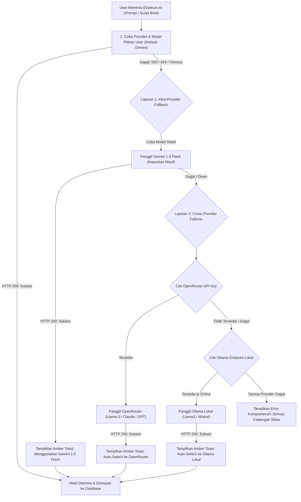

# Cetak Biru Arsitektur: Auto-Switch Provider AI & Multi-Tier Failover Engine
**Aplikasi:** Zeinity Creator Assistant / Executive Report Web App  
**Status:** Disetujui (Dokumen Pengingat / On Hold)  
**Terakhir Diperbarui:** 27 September 2026  

---

## 1. Latar Belakang & Analisa Masalah

### 1.1 Kejadian Error 503 (Service Unavailable)
Saat melakukan proses *"Lanjut: Generate Script Brief"* menggunakan model Gemini versi tertentu (misal: `gemini-3.8-flash` atau `gemini-3.7-flash`), sistem menerima error:
```
[GoogleGenerativeAI Error]: Error fetching from https://generativelanguage.googleapis.com/v1beta/models/gemini-3.8-flash:generateContent: 
[503] This model is currently experiencing high demand. Spikes in demand are usually temporary. Please try again later.
```

### 1.2 Diagnosis Teknis: 503 vs 429
- **Bukan Masalah Kuota (Bukan 429):** Jika kuota gratis API Key habis (*Rate Limit / Daily Quota Exceeded*), status HTTP yang dikembalikan adalah `429 Too Many Requests` (`RESOURCE_EXHAUSTED`).
- **Masalah Server Eksternal (503):** Kode `503` membuktikan bahwa infrastruktur server datacenter Google untuk klaster model eksperimental/preview tersebut sedang mengalami lonjakan beban (*traffic spike*) global.
- **Keterbatasan Single-Provider:** Ketergantungan murni pada satu model tunggal menyebabkan alur kerja kreator (*content pipeline*) terhenti saat server eksternal mengalami kendala sementara.

---

## 2. Solusi: Multi-Tier Failover Engine (Konsep Mirip 9router / LiteLLM)

Tujuan arsitektur ini adalah menjamin **Zero-Downtime & Kesinambungan Alur Kerja Kreator**. Sistem tidak boleh membiarkan proses terhenti hanya karena satu model/provider sedang sibuk.

### Diagram Alur Kerja (Failover Ladder)



---

## 3. Spesifikasi Dua Lapisan Ketahanan (Two-Layer Resilience)

### Lapisan 1: Intra-Provider Fallback (Cadangan Internal)
- Jika model yang dipilih user adalah model preview/eksperimental (misal `gemini-3.8-flash` / `gemini-3.7-flash`) dan mengembalikan error `503` (High Demand) atau `429`:
  - Sistem **tidak langsung melempar error merah**.
  - Sistem secara otomatis memanggil model rilis publik Google yang paling stabil: **`gemini-1.5-flash`**.
  - Jika berhasil, proses selesai seketika dengan notifikasi informatif halus kepada pengguna.

### Lapisan 2: Cross-Provider Auto Failover (Peralihan Antar-Provider)
- Jika seluruh model Google Gemini tidak dapat dihubungi (gangguan regional atau kehabisan total kuota):
  - Sistem memeriksa konfigurasi di tabel `settings` Supabase:
    1. **OpenRouter**: Jika `openrouter_api_key` terisi, lakukan permintaan ke endpoint OpenRouter menggunakan model yang sudah dipilih user (misal `meta-llama/llama-3-8b-instruct`).
    2. **Ollama**: Jika OpenRouter tidak aktif atau gagal, sistem memeriksa `ollama_endpoint` lokal. Jika server lokal aktif, dialihkan ke model Ollama lokal.

---

## 4. Rencana Modifikasi Berkas & Komponen

| Berkas | Peran & Perubahan yang Direncanakan |
|---|---|
| `src/lib/gemini.ts` | Tambahkan fungsi `callAIWithFailover(prompt, primaryConfig, allSettings)` dengan loop *failover ladder* dan penangkapan kode `503`/`429`. |
| `src/hooks/useSettings.ts` | Tambahkan opsi setting baru: `auto_failover_enabled: 'true'` (default aktif). |
| `src/views/Settings.tsx` | Tambahkan saklar toggle UI: *"Aktifkan Auto-Switch Provider jika Server Sibuk (Failover)"*. |
| `src/views/ScriptDetail.tsx` & `src/App.tsx` | Tambahkan penanganan pesan notifikasi lembut (*Amber Warning Toast*) ketika eksekusi dialihkan ke provider cadangan. |

---

## 5. Panduan Transparansi UX untuk Kreator

Kreator berhak tahu model mana yang menghasilkan output:
- **Badge Indikator:** Jika proses dialihkan, tampilkan lencana kecil di kartu prompt:  
  `⚠️ Dihasilkan via cadangan: Gemini 1.5 Flash (Server 3.8 sedang sibuk)`
- **Catatan Riwayat Log:** Catat peralihan ke panel terminal log agar mudah diaudit.

---

## 6. Jadwal & Keputusan Eksekusi
- **Status Saat Ini:** **Ditunda (On Hold)** sesuai arahan pengguna, karena kendala berasal dari lonjakan beban sementara di pihak Google AI Studio.
- **Rekomendasi Sementara:** Pilih model publik **`gemini-1.5-flash`** pada menu *Settings* untuk alur kerja yang stabil tanpa kendala 503.
- **Pemicu Eksekusi:** Fitur ini dapat diimplementasikan kapan saja ketika pengguna merasa kesiapan multi-provider (Gemini + OpenRouter + Ollama) sudah ingin diaktifkan secara otomatis.
